# Source code for GWAS project - Asbjørn Kjær 


This document shows the source code for the analysis of the GWAS data.  
It is a mix of "bash commands" and R code.  
Bash commands are included in markdown cells in the format:  
`
plink --bfile eye_color --missing --allow-no-sex --out EC-QC
`  
While R code is included as R code chunks

# Quality control 

Before quality control we start with 1287 individuals and 960613 total genotyped variants

## missing data

`
plink --bfile eye_color --missing --allow-no-sex --out EC-QC!
`

`
plink --bfile eye_color --het --out EC-QC --allow-no-sex!`


```R
library(tidyverse)
library(qqman)
```

    ── Attaching packages ─────────────────────────────────────── tidyverse 1.3.0 ──
    
    ✔ ggplot2 3.3.3     ✔ purrr   0.3.4
    ✔ tibble  3.0.6     ✔ dplyr   1.0.4
    ✔ tidyr   1.1.2     ✔ stringr 1.4.0
    ✔ readr   1.4.0     ✔ forcats 0.5.1
    
    ── Conflicts ────────────────────────────────────────── tidyverse_conflicts() ──
    ✖ dplyr::filter() masks stats::filter()
    ✖ dplyr::lag()    masks stats::lag()
    
    
    
    For example usage please run: vignette('qqman')
    
    
    
    Citation appreciated but not required:
    
    Turner, (2018). qqman: an R package for visualizing GWAS results using Q-Q and manhattan plots. Journal of Open Source Software, 3(25), 731, https://doi.org/10.21105/joss.00731.
    
    
    


```R
d_miss <- read.table("EC-QC.imiss",header=T)
d_het <- read.table("EC-QC.het",header=T)
d <- inner_join(d_miss,d_het)
```

    Joining, by = c("FID", "IID")
    


```R
dim(d)
head(d)
```


<style>
.list-inline {list-style: none; margin:0; padding: 0}
.list-inline>li {display: inline-block}
.list-inline>li:not(:last-child)::after {content: "\00b7"; padding: 0 .5ex}
</style>
<ol class=list-inline><li>1287</li><li>10</li></ol>


<table class="dataframe">
<caption>A data.frame: 6 × 10</caption>
<thead>
	<tr><th></th><th scope=col>FID</th><th scope=col>IID</th><th scope=col>MISS_PHENO</th><th scope=col>N_MISS</th><th scope=col>N_GENO</th><th scope=col>F_MISS</th><th scope=col>O.HOM.</th><th scope=col>E.HOM.</th><th scope=col>N.NM.</th><th scope=col>F</th></tr>
	<tr><th></th><th scope=col>&lt;int&gt;</th><th scope=col>&lt;int&gt;</th><th scope=col>&lt;chr&gt;</th><th scope=col>&lt;int&gt;</th><th scope=col>&lt;int&gt;</th><th scope=col>&lt;dbl&gt;</th><th scope=col>&lt;int&gt;</th><th scope=col>&lt;dbl&gt;</th><th scope=col>&lt;int&gt;</th><th scope=col>&lt;dbl&gt;</th></tr>
</thead>
<tbody>
	<tr><th scope=row>1</th><td>1010</td><td>1010</td><td>Y</td><td>417559</td><td>958847</td><td>0.435500</td><td>355012</td><td>353100</td><td>522943</td><td>0.011510</td></tr>
	<tr><th scope=row>2</th><td>1013</td><td>1013</td><td>Y</td><td>  1589</td><td>958847</td><td>0.001657</td><td>622171</td><td>618900</td><td>897402</td><td>0.011880</td></tr>
	<tr><th scope=row>3</th><td>1020</td><td>1020</td><td>Y</td><td>  3555</td><td>958847</td><td>0.003708</td><td>620700</td><td>617700</td><td>895619</td><td>0.010850</td></tr>
	<tr><th scope=row>4</th><td>1022</td><td>1022</td><td>Y</td><td> 23735</td><td>958847</td><td>0.024750</td><td>609152</td><td>605200</td><td>877300</td><td>0.014590</td></tr>
	<tr><th scope=row>5</th><td>1024</td><td>1024</td><td>Y</td><td> 23896</td><td>958847</td><td>0.024920</td><td>606768</td><td>605000</td><td>876929</td><td>0.006683</td></tr>
	<tr><th scope=row>6</th><td>1026</td><td>1026</td><td>Y</td><td> 23264</td><td>958847</td><td>0.024260</td><td>611711</td><td>605300</td><td>877569</td><td>0.023400</td></tr>
</tbody>
</table>


N.NM. = Nr of non missing genotypes  
O.HOM.= Nr of observed Homozygote genotypes

(N.NM.-O.HOM.)/N.NM. = heterozygozity rate


```R
d <- d %>% 
    mutate(Het = (N.NM.-O.HOM.)/N.NM.)  #het = heterozygozity rate
```


```R
mean_het = mean(d$Het)
sd_het = sd(d$Het)

d  %>% 
ggplot()+
geom_point(mapping=aes(x=Het,y=F_MISS)) +
geom_vline(xintercept = mean_het, color ="red")+
geom_vline(xintercept = mean_het-3*sd_het, color ="blue")+
geom_vline(xintercept = mean_het+3*sd_het, color ="blue")+
xlab("Heterozygosity rate")+
ylab("Proportion of missing SNPs")
ggsave("S1.pdf")
```

    Saving 6.67 x 6.67 in image
    


    
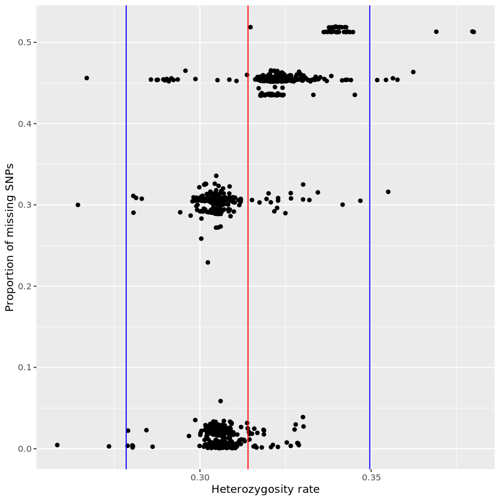
    


__Red line__ --> mean heterozygosity rate  
__Blue lines__ --> +-3*sd from mean heterozygosity rate 

This plot shows 4 groups of missingness. These four groups corresponds to (at least) 4 different chips, with different amount of SNPs genotyped.   
  
Normally you would filter out samples with large amounts of missing data. However, in these samples this filter would filter out any individual not genotyped by the chip with the most SNPs.  

You can also filter based on outlying heterozygosity rate. The different chips seems to have differing means, which complicates this filtering.  
Since there are no extreme outliers, this filter is skipped as well  


## Identity be descent 

Pruning variants in LD with each other (only used for analysis )

`
plink --bfile eye_color --indep-pairwise 500kb 5 0.2 --out eye_color
`

`
plink --bfile eye_color --extract eye_color.prune.in --genome --min 0.09375 --out eye_color
`

expected PI_HAT (IBD proportion)  
MZ twins = 1  
siblings 0.5  
first cousins 0.0125  
first cousins-OR 0.0625  
second cousins   0.0325

mean of 1st cousins and 1st cousins-OR = 0.09375


```R
ibd <- read.table('eye_color.genome', header = TRUE)
```


```R
ibd
```


<table class="dataframe">
<caption>A data.frame: 40 × 14</caption>
<thead>
	<tr><th scope=col>FID1</th><th scope=col>IID1</th><th scope=col>FID2</th><th scope=col>IID2</th><th scope=col>RT</th><th scope=col>EZ</th><th scope=col>Z0</th><th scope=col>Z1</th><th scope=col>Z2</th><th scope=col>PI_HAT</th><th scope=col>PHE</th><th scope=col>DST</th><th scope=col>PPC</th><th scope=col>RATIO</th></tr>
	<tr><th scope=col>&lt;int&gt;</th><th scope=col>&lt;int&gt;</th><th scope=col>&lt;int&gt;</th><th scope=col>&lt;int&gt;</th><th scope=col>&lt;chr&gt;</th><th scope=col>&lt;lgl&gt;</th><th scope=col>&lt;dbl&gt;</th><th scope=col>&lt;dbl&gt;</th><th scope=col>&lt;dbl&gt;</th><th scope=col>&lt;dbl&gt;</th><th scope=col>&lt;int&gt;</th><th scope=col>&lt;dbl&gt;</th><th scope=col>&lt;dbl&gt;</th><th scope=col>&lt;dbl&gt;</th></tr>
</thead>
<tbody>
	<tr><td>1173</td><td>1173</td><td>4814</td><td>4814</td><td>UN</td><td>NA</td><td>0.0000</td><td>0.0000</td><td>1.0000</td><td>1.0000</td><td>-1</td><td>1.000000</td><td>1</td><td>       NA</td></tr>
	<tr><td>1239</td><td>1239</td><td>3048</td><td>3048</td><td>UN</td><td>NA</td><td>0.7957</td><td>0.2043</td><td>0.0000</td><td>0.1021</td><td>-1</td><td>0.766343</td><td>1</td><td>   2.6430</td></tr>
	<tr><td>1239</td><td>1239</td><td>5867</td><td>5867</td><td>UN</td><td>NA</td><td>0.7957</td><td>0.2043</td><td>0.0000</td><td>0.1022</td><td>-1</td><td>0.766366</td><td>1</td><td>   2.5188</td></tr>
	<tr><td>1259</td><td>1259</td><td>3048</td><td>3048</td><td>UN</td><td>NA</td><td>0.7900</td><td>0.2100</td><td>0.0000</td><td>0.1050</td><td>-1</td><td>0.766533</td><td>1</td><td>   2.6521</td></tr>
	<tr><td>1259</td><td>1259</td><td>5867</td><td>5867</td><td>UN</td><td>NA</td><td>0.7506</td><td>0.2494</td><td>0.0000</td><td>0.1247</td><td>-1</td><td>0.766517</td><td>1</td><td>   2.8049</td></tr>
	<tr><td>1269</td><td>1269</td><td>1275</td><td>1275</td><td>UN</td><td>NA</td><td>0.0016</td><td>0.9588</td><td>0.0396</td><td>0.5190</td><td>-1</td><td>0.873488</td><td>1</td><td>1847.0000</td></tr>
	<tr><td>1338</td><td>1338</td><td>1375</td><td>1375</td><td>UN</td><td>NA</td><td>0.8100</td><td>0.1900</td><td>0.0000</td><td>0.0950</td><td>-1</td><td>0.791547</td><td>1</td><td>   2.6731</td></tr>
	<tr><td>1338</td><td>1338</td><td>1659</td><td>1659</td><td>UN</td><td>NA</td><td>0.7700</td><td>0.2300</td><td>0.0000</td><td>0.1150</td><td>-1</td><td>0.791209</td><td>1</td><td>   2.8258</td></tr>
	<tr><td>1338</td><td>1338</td><td>1678</td><td>1678</td><td>UN</td><td>NA</td><td>0.7966</td><td>0.2034</td><td>0.0000</td><td>0.1017</td><td>-1</td><td>0.791511</td><td>1</td><td>   2.5031</td></tr>
	<tr><td>1338</td><td>1338</td><td>1877</td><td>1877</td><td>UN</td><td>NA</td><td>0.8044</td><td>0.1956</td><td>0.0000</td><td>0.0978</td><td>-1</td><td>0.790333</td><td>1</td><td>   2.6170</td></tr>
	<tr><td>1375</td><td>1375</td><td>1659</td><td>1659</td><td>UN</td><td>NA</td><td>0.7944</td><td>0.2056</td><td>0.0000</td><td>0.1028</td><td>-1</td><td>0.793155</td><td>1</td><td>   2.8383</td></tr>
	<tr><td>1375</td><td>1375</td><td>1877</td><td>1877</td><td>UN</td><td>NA</td><td>0.7954</td><td>0.2046</td><td>0.0000</td><td>0.1023</td><td>-1</td><td>0.792646</td><td>1</td><td>   2.7158</td></tr>
	<tr><td>1424</td><td>1424</td><td>6035</td><td>6035</td><td>UN</td><td>NA</td><td>0.0000</td><td>0.0000</td><td>1.0000</td><td>1.0000</td><td>-1</td><td>1.000000</td><td>1</td><td>       NA</td></tr>
	<tr><td>1659</td><td>1659</td><td>1678</td><td>1678</td><td>UN</td><td>NA</td><td>0.8043</td><td>0.1957</td><td>0.0000</td><td>0.0979</td><td>-1</td><td>0.789696</td><td>1</td><td>   2.7255</td></tr>
	<tr><td>1659</td><td>1659</td><td>1877</td><td>1877</td><td>UN</td><td>NA</td><td>0.7906</td><td>0.2094</td><td>0.0000</td><td>0.1047</td><td>-1</td><td>0.791298</td><td>1</td><td>   2.7781</td></tr>
	<tr><td>1659</td><td>1659</td><td>2513</td><td>2513</td><td>UN</td><td>NA</td><td>0.8036</td><td>0.1964</td><td>0.0000</td><td>0.0982</td><td>-1</td><td>0.790876</td><td>1</td><td>   2.5953</td></tr>
	<tr><td>1659</td><td>1659</td><td>3186</td><td>3186</td><td>UN</td><td>NA</td><td>0.8102</td><td>0.1898</td><td>0.0000</td><td>0.0949</td><td>-1</td><td>0.787198</td><td>1</td><td>   2.5159</td></tr>
	<tr><td>1678</td><td>1678</td><td>1877</td><td>1877</td><td>UN</td><td>NA</td><td>0.7856</td><td>0.2144</td><td>0.0000</td><td>0.1072</td><td>-1</td><td>0.790718</td><td>1</td><td>   2.6082</td></tr>
	<tr><td>1678</td><td>1678</td><td>2513</td><td>2513</td><td>UN</td><td>NA</td><td>0.7891</td><td>0.2109</td><td>0.0000</td><td>0.1055</td><td>-1</td><td>0.792130</td><td>1</td><td>   2.6673</td></tr>
	<tr><td>1775</td><td>1775</td><td>2083</td><td>2083</td><td>UN</td><td>NA</td><td>0.0000</td><td>0.0000</td><td>1.0000</td><td>1.0000</td><td>-1</td><td>1.000000</td><td>1</td><td>       NA</td></tr>
	<tr><td>1877</td><td>1877</td><td>2513</td><td>2513</td><td>UN</td><td>NA</td><td>0.7878</td><td>0.2122</td><td>0.0000</td><td>0.1061</td><td>-1</td><td>0.793320</td><td>1</td><td>   2.5719</td></tr>
	<tr><td>1877</td><td>1877</td><td>3186</td><td>3186</td><td>UN</td><td>NA</td><td>0.7741</td><td>0.2259</td><td>0.0000</td><td>0.1129</td><td>-1</td><td>0.790243</td><td>1</td><td>   2.6701</td></tr>
	<tr><td>2513</td><td>2513</td><td>3186</td><td>3186</td><td>UN</td><td>NA</td><td>0.8040</td><td>0.1960</td><td>0.0000</td><td>0.0980</td><td>-1</td><td>0.789544</td><td>1</td><td>   2.6164</td></tr>
	<tr><td>2651</td><td>2651</td><td> 912</td><td> 912</td><td>UN</td><td>NA</td><td>0.0020</td><td>0.9748</td><td>0.0232</td><td>0.5106</td><td>-1</td><td>0.871290</td><td>1</td><td>1146.0000</td></tr>
	<tr><td>2887</td><td>2887</td><td>3783</td><td>3783</td><td>UN</td><td>NA</td><td>0.7730</td><td>0.2270</td><td>0.0000</td><td>0.1135</td><td>-1</td><td>0.756334</td><td>1</td><td>   2.9848</td></tr>
	<tr><td>3048</td><td>3048</td><td>5867</td><td>5867</td><td>UN</td><td>NA</td><td>0.7477</td><td>0.2523</td><td>0.0000</td><td>0.1262</td><td>-1</td><td>0.766394</td><td>1</td><td>   3.1572</td></tr>
	<tr><td>3783</td><td>3783</td><td>4006</td><td>4006</td><td>UN</td><td>NA</td><td>0.7852</td><td>0.2148</td><td>0.0000</td><td>0.1074</td><td>-1</td><td>0.754590</td><td>1</td><td>   2.7114</td></tr>
	<tr><td>3783</td><td>3783</td><td>5989</td><td>5989</td><td>UN</td><td>NA</td><td>0.7812</td><td>0.2188</td><td>0.0000</td><td>0.1094</td><td>-1</td><td>0.755328</td><td>1</td><td>   2.8582</td></tr>
	<tr><td>3998</td><td>3998</td><td>6191</td><td>6191</td><td>UN</td><td>NA</td><td>0.0000</td><td>0.0000</td><td>1.0000</td><td>1.0000</td><td>-1</td><td>1.000000</td><td>1</td><td>       NA</td></tr>
	<tr><td>4198</td><td>4198</td><td>5867</td><td>5867</td><td>UN</td><td>NA</td><td>0.8056</td><td>0.1944</td><td>0.0000</td><td>0.0972</td><td>-1</td><td>0.759256</td><td>1</td><td>   2.4865</td></tr>
	<tr><td>4460</td><td>4460</td><td>5895</td><td>5895</td><td>UN</td><td>NA</td><td>0.0000</td><td>0.0000</td><td>1.0000</td><td>1.0000</td><td>-1</td><td>1.000000</td><td>1</td><td>       NA</td></tr>
	<tr><td>4547</td><td>4547</td><td>4632</td><td>4632</td><td>UN</td><td>NA</td><td>0.5346</td><td>0.4654</td><td>0.0000</td><td>0.2327</td><td>-1</td><td>0.805051</td><td>1</td><td>   4.2938</td></tr>
	<tr><td>4583</td><td>4583</td><td>4584</td><td>4584</td><td>UN</td><td>NA</td><td>0.2423</td><td>0.5276</td><td>0.2301</td><td>0.4939</td><td>-1</td><td>0.879427</td><td>1</td><td>  11.0065</td></tr>
	<tr><td>4583</td><td>4583</td><td>4585</td><td>4585</td><td>UN</td><td>NA</td><td>0.4258</td><td>0.5742</td><td>0.0000</td><td>0.2871</td><td>-1</td><td>0.825642</td><td>1</td><td>   5.7356</td></tr>
	<tr><td>4584</td><td>4584</td><td>4585</td><td>4585</td><td>UN</td><td>NA</td><td>0.4176</td><td>0.5824</td><td>0.0000</td><td>0.2912</td><td>-1</td><td>0.828922</td><td>1</td><td>   6.3111</td></tr>
	<tr><td>4897</td><td>4897</td><td>7520</td><td>7520</td><td>UN</td><td>NA</td><td>0.7957</td><td>0.2043</td><td>0.0000</td><td>0.1022</td><td>-1</td><td>0.783357</td><td>1</td><td>   2.6653</td></tr>
	<tr><td>5792</td><td>5792</td><td>9107</td><td>9107</td><td>UN</td><td>NA</td><td>0.0000</td><td>0.0000</td><td>1.0000</td><td>1.0000</td><td>-1</td><td>1.000000</td><td>1</td><td>       NA</td></tr>
	<tr><td> 651</td><td> 651</td><td> 903</td><td> 903</td><td>UN</td><td>NA</td><td>0.0020</td><td>0.9717</td><td>0.0264</td><td>0.5122</td><td>-1</td><td>0.871714</td><td>1</td><td>1830.0000</td></tr>
	<tr><td>8915</td><td>8915</td><td>9486</td><td>9486</td><td>UN</td><td>NA</td><td>0.0000</td><td>0.0000</td><td>1.0000</td><td>1.0000</td><td>-1</td><td>1.000000</td><td>1</td><td>       NA</td></tr>
	<tr><td>9277</td><td>9277</td><td>9283</td><td>9283</td><td>UN</td><td>NA</td><td>0.5541</td><td>0.4459</td><td>0.0000</td><td>0.2230</td><td>-1</td><td>0.791045</td><td>1</td><td>   4.7222</td></tr>
</tbody>
</table>


We have 40 relationsships that have ibd greater that the mean of expected ibd between 1st and 2nd cousins  

We remove individuals, so there is only 1 individual left pr relationshsip.  
This removes 27 individuals (see below)


```R
unique(ibd$FID1)
```


<style>
.list-inline {list-style: none; margin:0; padding: 0}
.list-inline>li {display: inline-block}
.list-inline>li:not(:last-child)::after {content: "\00b7"; padding: 0 .5ex}
</style>
<ol class=list-inline><li>1173</li><li>1239</li><li>1259</li><li>1269</li><li>1338</li><li>1375</li><li>1424</li><li>1659</li><li>1678</li><li>1775</li><li>1877</li><li>2513</li><li>2651</li><li>2887</li><li>3048</li><li>3783</li><li>3998</li><li>4198</li><li>4460</li><li>4547</li><li>4583</li><li>4584</li><li>4897</li><li>5792</li><li>651</li><li>8915</li><li>9277</li></ol>


```R
length(unique(ibd$FID1))
```


27


```R
write.table(cbind(unique(ibd$FID1),unique(ibd$FID1)), file = 'filter_ibd.txt', col.names = F, row.names = F)
```

## Aditional filters

`
plink --bfile eye_color --remove filter_ibd.txt --geno 0.75 --hwe 0.00001 --maf 0.01 --make-bed --out eye_color_QC
`

--geno 0.75 --> removes SNPs with over 75% missing data (removes 8296)  
--HWe 0.00001--> removes SNPs that deviates from HWE with p<1e-5  (removes 24512)  
--maf 0.01 --> removes SNPs where the minor allele frequency < 1% (removes 90307)

## QC conclusions

837498 variants and 1260 people pass filters and QC


# Testing for association

## Making phenotype
First phenotype we try is brown/dark vs light eye colors


```R
colors <- read.table("eye_color.txt")
colnames(colors) = c("IID", "eye_color")
head(colors)
```


<table class="dataframe">
<caption>A data.frame: 6 × 2</caption>
<thead>
	<tr><th></th><th scope=col>IID</th><th scope=col>eye_color</th></tr>
	<tr><th></th><th scope=col>&lt;int&gt;</th><th scope=col>&lt;chr&gt;</th></tr>
</thead>
<tbody>
	<tr><th scope=row>1</th><td>1010</td><td>brown            </td></tr>
	<tr><th scope=row>2</th><td>1013</td><td>hazel/brown-green</td></tr>
	<tr><th scope=row>3</th><td>1020</td><td>blue             </td></tr>
	<tr><th scope=row>4</th><td>1022</td><td>blue-green       </td></tr>
	<tr><th scope=row>5</th><td>1024</td><td>blue             </td></tr>
	<tr><th scope=row>6</th><td>1026</td><td>hazel/brown-green</td></tr>
</tbody>
</table>


```R
unique(colors$eye_color)
```


<style>
.list-inline {list-style: none; margin:0; padding: 0}
.list-inline>li {display: inline-block}
.list-inline>li:not(:last-child)::after {content: "\00b7"; padding: 0 .5ex}
</style>
<ol class=list-inline><li>'brown'</li><li>'hazel/brown-green'</li><li>'blue'</li><li>'blue-green'</li><li>'green'</li><li>'blue-grey'</li><li>'dark_brown'</li><li>'amber-brown'</li><li>'dark_blue'</li><li>'green-gray'</li><li>'blue-green-gold'</li><li>'blue-green-grey'</li></ol>


We group any brown colors together and any non brown colors together

(note hazel brown is actually a relativly light brown color)


```R
dark = c("brown",'hazel/brown-green','dark_brown','amber-brown')

pheno <- colors  %>% 
    mutate(color_binary = ifelse(eye_color %in% dark, 1, 2))  %>% 
    mutate(FID = IID)
head(pheno)
pheno <- pheno  %>% select(IID, FID, color_binary)
head(pheno)
write.table(pheno, "phenotypes_brown_vs_not.txt", col.names = FALSE, row.names = FALSE)
```


<table class="dataframe">
<caption>A data.frame: 6 × 4</caption>
<thead>
	<tr><th></th><th scope=col>IID</th><th scope=col>eye_color</th><th scope=col>color_binary</th><th scope=col>FID</th></tr>
	<tr><th></th><th scope=col>&lt;int&gt;</th><th scope=col>&lt;chr&gt;</th><th scope=col>&lt;dbl&gt;</th><th scope=col>&lt;int&gt;</th></tr>
</thead>
<tbody>
	<tr><th scope=row>1</th><td>1010</td><td>brown            </td><td>1</td><td>1010</td></tr>
	<tr><th scope=row>2</th><td>1013</td><td>hazel/brown-green</td><td>1</td><td>1013</td></tr>
	<tr><th scope=row>3</th><td>1020</td><td>blue             </td><td>2</td><td>1020</td></tr>
	<tr><th scope=row>4</th><td>1022</td><td>blue-green       </td><td>2</td><td>1022</td></tr>
	<tr><th scope=row>5</th><td>1024</td><td>blue             </td><td>2</td><td>1024</td></tr>
	<tr><th scope=row>6</th><td>1026</td><td>hazel/brown-green</td><td>1</td><td>1026</td></tr>
</tbody>
</table>


<table class="dataframe">
<caption>A data.frame: 6 × 3</caption>
<thead>
	<tr><th></th><th scope=col>IID</th><th scope=col>FID</th><th scope=col>color_binary</th></tr>
	<tr><th></th><th scope=col>&lt;int&gt;</th><th scope=col>&lt;int&gt;</th><th scope=col>&lt;dbl&gt;</th></tr>
</thead>
<tbody>
	<tr><th scope=row>1</th><td>1010</td><td>1010</td><td>1</td></tr>
	<tr><th scope=row>2</th><td>1013</td><td>1013</td><td>1</td></tr>
	<tr><th scope=row>3</th><td>1020</td><td>1020</td><td>2</td></tr>
	<tr><th scope=row>4</th><td>1022</td><td>1022</td><td>2</td></tr>
	<tr><th scope=row>5</th><td>1024</td><td>1024</td><td>2</td></tr>
	<tr><th scope=row>6</th><td>1026</td><td>1026</td><td>1</td></tr>
</tbody>
</table>


# Testing association


`
plink --bfile eye_color_QC --assoc fisher --pheno phenotypes_brown_vs_not.txt --out eye_color --allow-no-sex
`


```R
setwd("/faststorage/project/populationgenomics/students/askj/project")#we do this in another folder for easier overview
```


```R
fisher <- read.table('eye_color.assoc.fisher', head=T)
manhattan(fisher)
```


    
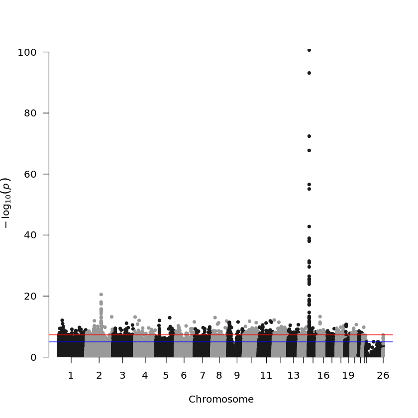
    


```R
qq(fisher$P)
```


    
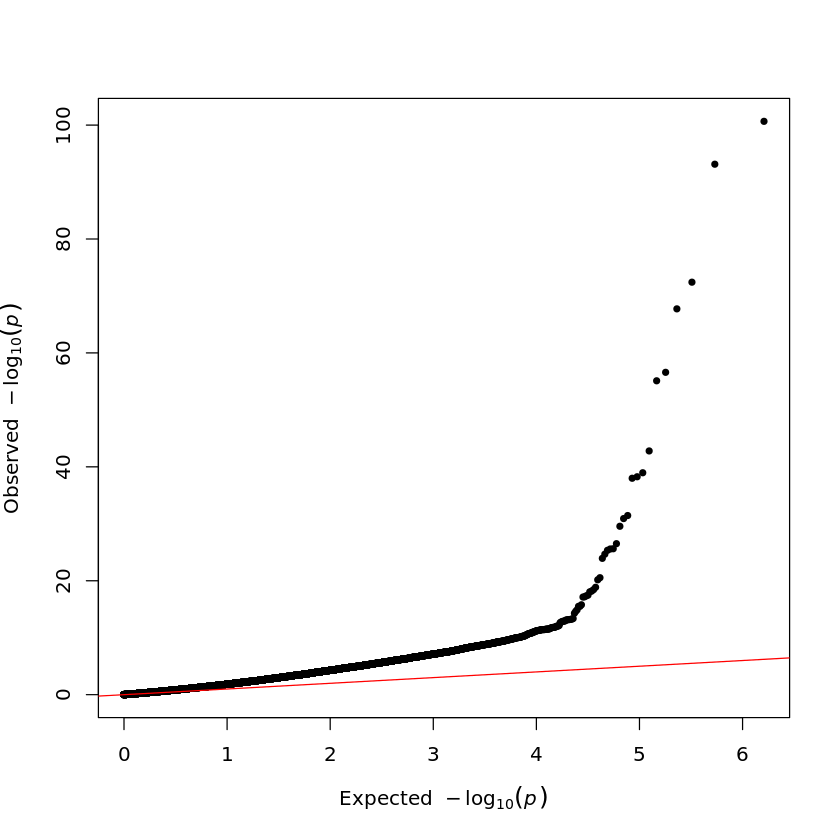
    


### Calculating inflation factor


```R
qp = qchisq(fisher$P, df=1, lower.tail=F) #chi^2 val for all p-values
median(qp)
qchisq(0.5, df=1, lower.tail=F) #expected median chi^2 value
print(paste("inflation factor:" ,median(qp)/qchisq(0.5, df=1, lower.tail=F)))

```


0.883297898015889


0.454936423119573


    [1] "inflation factor: 1.94158535814515"


From the 2 plots it is clear that the p-values are inflated. Presumably because of population stratification 
This was expected because eye color is heavily associated with population 

## Corection for population stratification

Calculating PCs  

Pruning:  
`
plink --bfile eye_color_QC --indep-pairwise 500kb 5 0.2 --out pca
`

`
plink --bfile eye_color_QC --extract pca.prune.in --pca 20 --out pca
`


```R
e <- read.table('pca.eigenvec')
colnames(e)= c("id1","id2", paste("PC", 1:20, sep="")) 
pheno <- read.table("phenotypes_brown_vs_not.txt")
colnames(pheno) <- c("id1", "id2", "phenotype")
pheno <- pheno  %>% mutate(phenotype = ifelse(phenotype==1, "Brown","Light"))
e = inner_join(pheno, e)
head(e)

```

    Joining, by = c("id1", "id2")
    


<table class="dataframe">
<caption>A data.frame: 6 × 23</caption>
<thead>
	<tr><th></th><th scope=col>id1</th><th scope=col>id2</th><th scope=col>phenotype</th><th scope=col>PC1</th><th scope=col>PC2</th><th scope=col>PC3</th><th scope=col>PC4</th><th scope=col>PC5</th><th scope=col>PC6</th><th scope=col>PC7</th><th scope=col>⋯</th><th scope=col>PC11</th><th scope=col>PC12</th><th scope=col>PC13</th><th scope=col>PC14</th><th scope=col>PC15</th><th scope=col>PC16</th><th scope=col>PC17</th><th scope=col>PC18</th><th scope=col>PC19</th><th scope=col>PC20</th></tr>
	<tr><th></th><th scope=col>&lt;int&gt;</th><th scope=col>&lt;int&gt;</th><th scope=col>&lt;chr&gt;</th><th scope=col>&lt;dbl&gt;</th><th scope=col>&lt;dbl&gt;</th><th scope=col>&lt;dbl&gt;</th><th scope=col>&lt;dbl&gt;</th><th scope=col>&lt;dbl&gt;</th><th scope=col>&lt;dbl&gt;</th><th scope=col>&lt;dbl&gt;</th><th scope=col>⋯</th><th scope=col>&lt;dbl&gt;</th><th scope=col>&lt;dbl&gt;</th><th scope=col>&lt;dbl&gt;</th><th scope=col>&lt;dbl&gt;</th><th scope=col>&lt;dbl&gt;</th><th scope=col>&lt;dbl&gt;</th><th scope=col>&lt;dbl&gt;</th><th scope=col>&lt;dbl&gt;</th><th scope=col>&lt;dbl&gt;</th><th scope=col>&lt;dbl&gt;</th></tr>
</thead>
<tbody>
	<tr><th scope=row>1</th><td>1010</td><td>1010</td><td>Brown</td><td>0.00186361</td><td>-0.00595087</td><td> 0.02187750</td><td> 0.01278490</td><td> 0.02003310</td><td>-0.01270480</td><td> 3.00830e-03</td><td>⋯</td><td>-0.01173650</td><td> 0.00928513</td><td> 0.00735282</td><td>-0.015368300</td><td> 0.00864294</td><td> 0.015732300</td><td> 0.002466140</td><td>-0.003456180</td><td>-0.001591140</td><td>-0.00761695</td></tr>
	<tr><th scope=row>2</th><td>1013</td><td>1013</td><td>Brown</td><td>0.01182980</td><td>-0.00212206</td><td>-0.01287550</td><td>-0.00916655</td><td>-0.00913004</td><td>-0.00113367</td><td> 1.88023e-03</td><td>⋯</td><td>-0.00259373</td><td> 0.00829078</td><td> 0.00221898</td><td> 0.000614906</td><td> 0.00293616</td><td>-0.002587290</td><td> 0.005794570</td><td>-0.005711070</td><td>-0.005347950</td><td>-0.00766870</td></tr>
	<tr><th scope=row>3</th><td>1020</td><td>1020</td><td>Light</td><td>0.01035490</td><td>-0.00508999</td><td>-0.01415360</td><td>-0.01194530</td><td>-0.00787076</td><td>-0.00295176</td><td>-3.18942e-05</td><td>⋯</td><td>-0.00276107</td><td>-0.00633277</td><td>-0.00573836</td><td> 0.005945100</td><td> 0.00782449</td><td>-0.000470341</td><td>-0.000956082</td><td> 0.006623060</td><td> 0.000698147</td><td> 0.00544821</td></tr>
	<tr><th scope=row>4</th><td>1022</td><td>1022</td><td>Light</td><td>0.01122920</td><td>-0.00268797</td><td>-0.01210510</td><td>-0.00925893</td><td>-0.00509233</td><td>-0.00790253</td><td>-1.37015e-03</td><td>⋯</td><td>-0.01169910</td><td>-0.00372389</td><td>-0.00248874</td><td> 0.002718760</td><td>-0.00128260</td><td>-0.005774430</td><td> 0.001988260</td><td>-0.003259040</td><td> 0.002005190</td><td> 0.00760142</td></tr>
	<tr><th scope=row>5</th><td>1024</td><td>1024</td><td>Light</td><td>0.00715355</td><td>-0.00179215</td><td>-0.00602916</td><td>-0.00454150</td><td> 0.00140583</td><td> 0.00293056</td><td> 1.80199e-03</td><td>⋯</td><td> 0.00538757</td><td>-0.00625709</td><td>-0.01028530</td><td>-0.002641920</td><td>-0.00226604</td><td> 0.006617140</td><td>-0.000449053</td><td> 0.000898369</td><td> 0.000171410</td><td> 0.01140750</td></tr>
	<tr><th scope=row>6</th><td>1026</td><td>1026</td><td>Brown</td><td>0.01031880</td><td>-0.00296708</td><td>-0.01419620</td><td>-0.00953844</td><td>-0.00256996</td><td>-0.00527398</td><td>-8.02986e-03</td><td>⋯</td><td>-0.00085809</td><td>-0.00481554</td><td>-0.00780685</td><td>-0.001326430</td><td>-0.00688199</td><td>-0.000746695</td><td> 0.001062150</td><td> 0.008509600</td><td>-0.000161794</td><td>-0.01317770</td></tr>
</tbody>
</table>


```R
ev <- read.table('pca.eigenval')
ev  %>% ggplot + geom_point(aes(x=1:20, y=V1)) + xlab("PC number") +ylab("Eigenvalue")
```


    
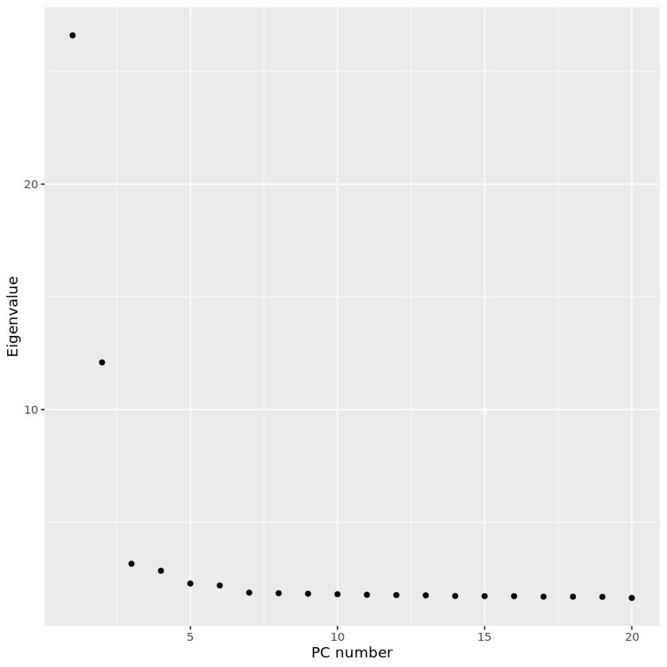
    


Eigenvalues are proportional to the amount of variance captured by each PC.
There is a clear drop of after 2 PCs, and therefore it makes sence to choose 2 PCs (you usually chose based on this)


```R
ggplot(e)+
    geom_point(mapping=aes(x=PC1, y=PC2, color = as.factor(phenotype))) + labs(color='Phenotype') +
    scale_color_manual(labels=c("Brown","Light"),values=c( "#55230C","#085C98" ))
ggsave("pca.pdf")
```

    Saving 6.67 x 6.67 in image
    


    
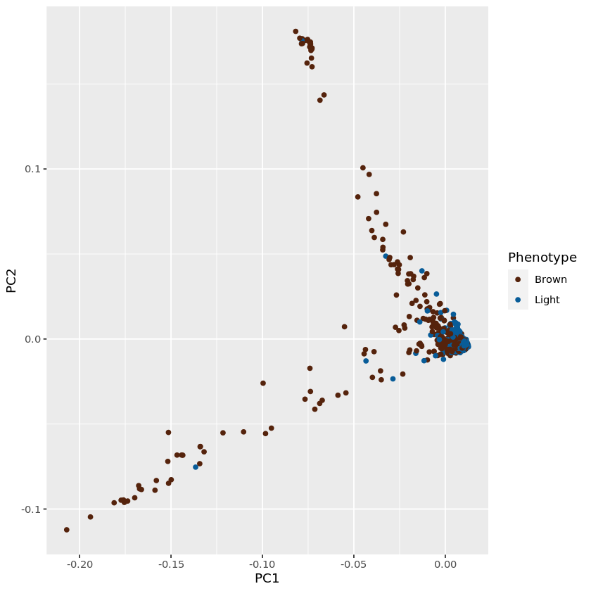
    


In this plot you can see that there is significant population stratification. This structure is heavely correlated with eye color phenotype, which can explain the heavy inflation in p-values.  
There are 2 arms, which most likely represent african and asian population. (speculation)

If eye color is associated with e.g. being african. Then SNPs that are associated with being african will seem associated with eye color. Even though they have no influence on eye color.

We can correct for this by including the 2 PCs in the association test:


`
plink --bfile eye_color_QC --logistic --pheno phenotypes_brown_vs_not.txt --allow-no-sex --covar pca.eigenvec --covar-number 1-2
`


```R
logistic_pca_correct <- read.table('plink.assoc.logistic', header = TRUE)
```


```R
logistic_pca_correct <- logistic_pca_correct  %>% filter(TEST=="ADD")
```


```R
dim(logistic_pca_correct)
significant_logistic_pca_correct  <-logistic_pca_correct  %>% filter(P<5e-8) %>% arrange(BP)  %>% 
                                     mutate(region = ifelse(BP < 28344444, "OCA2",
                                                                    ifelse(BP < 28356182, "inter", "HERC2")))
                                             
significant_logistic_pca_correct                                            
max(significant_logistic_pca_correct$BP) - min(significant_logistic_pca_correct$BP)

```


<style>
.list-inline {list-style: none; margin:0; padding: 0}
.list-inline>li {display: inline-block}
.list-inline>li:not(:last-child)::after {content: "\00b7"; padding: 0 .5ex}
</style>
<ol class=list-inline><li>837498</li><li>9</li></ol>


<table class="dataframe">
<caption>A data.frame: 24 × 10</caption>
<thead>
	<tr><th scope=col>CHR</th><th scope=col>SNP</th><th scope=col>BP</th><th scope=col>A1</th><th scope=col>TEST</th><th scope=col>NMISS</th><th scope=col>OR</th><th scope=col>STAT</th><th scope=col>P</th><th scope=col>region</th></tr>
	<tr><th scope=col>&lt;int&gt;</th><th scope=col>&lt;chr&gt;</th><th scope=col>&lt;int&gt;</th><th scope=col>&lt;chr&gt;</th><th scope=col>&lt;chr&gt;</th><th scope=col>&lt;int&gt;</th><th scope=col>&lt;dbl&gt;</th><th scope=col>&lt;dbl&gt;</th><th scope=col>&lt;dbl&gt;</th><th scope=col>&lt;chr&gt;</th></tr>
</thead>
<tbody>
	<tr><td>15</td><td>rs749846  </td><td>28268990</td><td>A</td><td>ADD</td><td> 998</td><td>0.42030</td><td> -6.525</td><td>6.800e-11</td><td>OCA2 </td></tr>
	<tr><td>15</td><td>rs3794604 </td><td>28272065</td><td>T</td><td>ADD</td><td>1234</td><td>0.38570</td><td> -7.056</td><td>1.718e-12</td><td>OCA2 </td></tr>
	<tr><td>15</td><td>rs4778232 </td><td>28281765</td><td>T</td><td>ADD</td><td>1259</td><td>0.46200</td><td> -7.697</td><td>1.388e-14</td><td>OCA2 </td></tr>
	<tr><td>15</td><td>rs16950821</td><td>28283507</td><td>A</td><td>ADD</td><td>1260</td><td>0.35270</td><td> -7.659</td><td>1.880e-14</td><td>OCA2 </td></tr>
	<tr><td>15</td><td>rs8024968 </td><td>28283689</td><td>T</td><td>ADD</td><td>1260</td><td>0.35060</td><td> -7.702</td><td>1.338e-14</td><td>OCA2 </td></tr>
	<tr><td>15</td><td>rs7177686 </td><td>28287344</td><td>A</td><td>ADD</td><td> 661</td><td>0.44920</td><td> -5.918</td><td>3.252e-09</td><td>OCA2 </td></tr>
	<tr><td>15</td><td>rs6497253 </td><td>28288549</td><td>A</td><td>ADD</td><td> 998</td><td>0.44920</td><td> -7.008</td><td>2.412e-12</td><td>OCA2 </td></tr>
	<tr><td>15</td><td>rs1375164 </td><td>28291812</td><td>T</td><td>ADD</td><td> 962</td><td>0.45350</td><td> -6.834</td><td>8.266e-12</td><td>OCA2 </td></tr>
	<tr><td>15</td><td>rs1597196 </td><td>28294922</td><td>T</td><td>ADD</td><td>1258</td><td>0.43750</td><td> -7.628</td><td>2.391e-14</td><td>OCA2 </td></tr>
	<tr><td>15</td><td>rs7179994 </td><td>28323770</td><td>G</td><td>ADD</td><td>1259</td><td>0.45470</td><td> -6.599</td><td>4.128e-11</td><td>OCA2 </td></tr>
	<tr><td>15</td><td>rs7174027 </td><td>28328765</td><td>A</td><td>ADD</td><td>1257</td><td>0.24260</td><td> -8.993</td><td>2.416e-19</td><td>OCA2 </td></tr>
	<tr><td>15</td><td>rs4778138 </td><td>28335820</td><td>G</td><td>ADD</td><td>1033</td><td>0.22170</td><td> -9.533</td><td>1.525e-21</td><td>OCA2 </td></tr>
	<tr><td>15</td><td>rs4778241 </td><td>28338713</td><td>A</td><td>ADD</td><td>1260</td><td>0.16300</td><td>-13.360</td><td>1.050e-40</td><td>OCA2 </td></tr>
	<tr><td>15</td><td>rs7495174 </td><td>28344238</td><td>G</td><td>ADD</td><td>1260</td><td>0.13960</td><td> -9.258</td><td>2.075e-20</td><td>OCA2 </td></tr>
	<tr><td>15</td><td>rs12593929</td><td>28359258</td><td>G</td><td>ADD</td><td> 701</td><td>0.07722</td><td> -7.414</td><td>1.222e-13</td><td>HERC2</td></tr>
	<tr><td>15</td><td>rs7183877 </td><td>28365733</td><td>A</td><td>ADD</td><td>1260</td><td>0.17000</td><td> -9.284</td><td>1.628e-20</td><td>HERC2</td></tr>
	<tr><td>15</td><td>rs3935591 </td><td>28374012</td><td>T</td><td>ADD</td><td> 636</td><td>0.06700</td><td>-11.330</td><td>9.572e-30</td><td>HERC2</td></tr>
	<tr><td>15</td><td>rs11636232</td><td>28386626</td><td>T</td><td>ADD</td><td>1235</td><td>3.46600</td><td> 11.860</td><td>1.816e-32</td><td>HERC2</td></tr>
	<tr><td>15</td><td>rs6497287 </td><td>28440287</td><td>C</td><td>ADD</td><td> 677</td><td>0.14520</td><td> -7.363</td><td>1.796e-13</td><td>HERC2</td></tr>
	<tr><td>15</td><td>rs8028689 </td><td>28488888</td><td>C</td><td>ADD</td><td> 736</td><td>0.08325</td><td> -6.853</td><td>7.252e-12</td><td>HERC2</td></tr>
	<tr><td>15</td><td>rs916977  </td><td>28513364</td><td>T</td><td>ADD</td><td>1111</td><td>0.07634</td><td>-14.730</td><td>4.114e-49</td><td>HERC2</td></tr>
	<tr><td>15</td><td>rs8039195 </td><td>28516084</td><td>C</td><td>ADD</td><td> 998</td><td>0.08334</td><td>-13.420</td><td>4.579e-41</td><td>HERC2</td></tr>
	<tr><td>15</td><td>rs16950987</td><td>28526228</td><td>A</td><td>ADD</td><td> 998</td><td>0.07551</td><td> -8.291</td><td>1.121e-16</td><td>HERC2</td></tr>
	<tr><td>15</td><td>rs1667394 </td><td>28530182</td><td>C</td><td>ADD</td><td>1147</td><td>0.06794</td><td>-15.600</td><td>7.373e-55</td><td>HERC2</td></tr>
</tbody>
</table>


261192


```R
manhattan(logistic_pca_correct,chr = "CHR",bp = "BP",p = "P",snp = "SNP" ,ylim = c(0, 60))
```


    
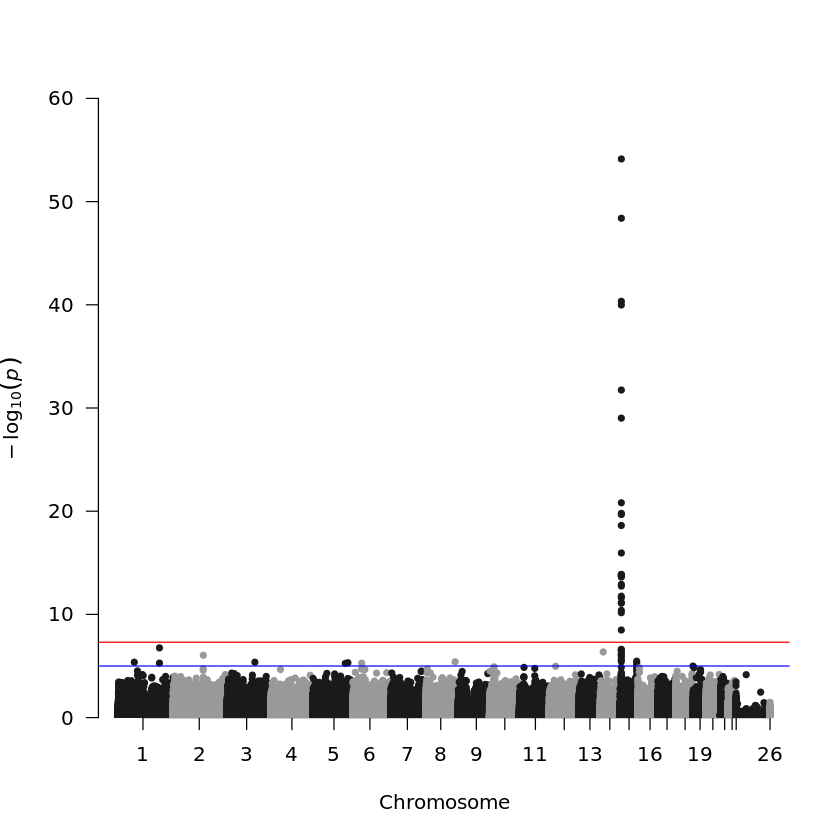
    


```R
manhattan(logistic_pca_correct,chr = "CHR",bp = "BP",p = "P",snp = "SNP" ,ylim = c(0, 9))
```


    
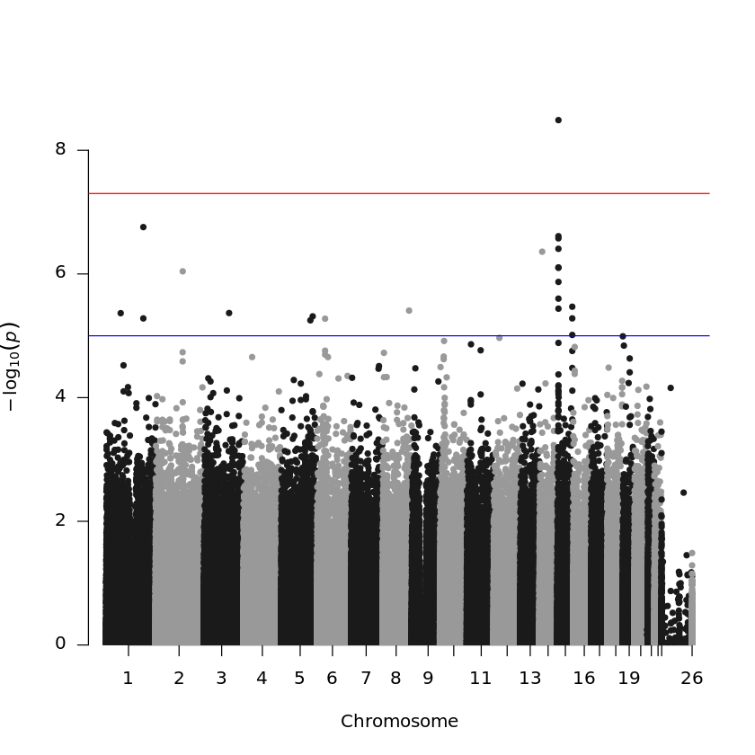
    


```R
qq(logistic_pca_correct$P)
```


    

    


```R
qp = qchisq( logistic_pca_correct  %>% select(P)  %>% na.omit()  %>% pull(), df=1, lower.tail=F) #chi^2 val for all p-values
median(qp)
qchisq(0.5, df=1, lower.tail=F) #expected median chi^2 value
print(paste("inflation factor:" ,median(qp)/qchisq(0.5, df=1, lower.tail=F)))
```


0.465639655439419


0.454936423119573


    [1] "inflation factor: 1.02352687491244"


The PCA corection gets rid of the inflation very nicely. The qqplot now looks as expected without structure

However now we only have 1 region that is significant over 5e-8 threshold.

## Mixed models

Mixed models can also correct for population stratification. 
So for good measure lets try that as well

Mixed models has the advantage that the genetic relationship matrix (GRM) can be used to estimate heritability of the phenotype.


If you fit the GRM of the whole data you fit the tested SNP as both "fixed effet" and "random effect". Basically you correct for the SNP you are trying to test.

Ideally you should do GRM without each SNP and test that, but this is very slow. The compromice is Leave one chromosome out. Here GRM are all other chromosomes, while you test SNPs on the chromosome left out

`
gcta64 --mlma-loco --bfile eye_color_QC --pheno phenotypes_brown_vs_not.txt --autosome --out eye_color_loco
`


```R
mlma_loco <- read.table('eye_color_loco.loco.mlma', header = TRUE)
```


```R
dim(mlma_loco)
significant_mlma_loco  <-mlma_loco  %>% filter(p<5e-8) %>% arrange(bp)  %>% 
                                     mutate(region = ifelse(bp < 28344444, "OCA2",
                                                                    ifelse(bp < 28356182, "inter", "HERC2")))
                                             
significant_mlma_loco                                            
max(significant_mlma_loco$bp) - min(significant_mlma_loco$bp)

```


<style>
.list-inline {list-style: none; margin:0; padding: 0}
.list-inline>li {display: inline-block}
.list-inline>li:not(:last-child)::after {content: "\00b7"; padding: 0 .5ex}
</style>
<ol class=list-inline><li>836776</li><li>9</li></ol>


<table class="dataframe">
<caption>A data.frame: 24 × 10</caption>
<thead>
	<tr><th scope=col>Chr</th><th scope=col>SNP</th><th scope=col>bp</th><th scope=col>A1</th><th scope=col>A2</th><th scope=col>Freq</th><th scope=col>b</th><th scope=col>se</th><th scope=col>p</th><th scope=col>region</th></tr>
	<tr><th scope=col>&lt;int&gt;</th><th scope=col>&lt;chr&gt;</th><th scope=col>&lt;int&gt;</th><th scope=col>&lt;chr&gt;</th><th scope=col>&lt;chr&gt;</th><th scope=col>&lt;dbl&gt;</th><th scope=col>&lt;dbl&gt;</th><th scope=col>&lt;dbl&gt;</th><th scope=col>&lt;dbl&gt;</th><th scope=col>&lt;chr&gt;</th></tr>
</thead>
<tbody>
	<tr><td>15</td><td>rs749846  </td><td>28268990</td><td>A</td><td>C</td><td>0.1938880</td><td>-0.182183</td><td>0.0272915</td><td>2.46459e-11</td><td>OCA2 </td></tr>
	<tr><td>15</td><td>rs3794604 </td><td>28272065</td><td>T</td><td>C</td><td>0.1353320</td><td>-0.202929</td><td>0.0277001</td><td>2.37241e-13</td><td>OCA2 </td></tr>
	<tr><td>15</td><td>rs4778232 </td><td>28281765</td><td>T</td><td>C</td><td>0.2883240</td><td>-0.172575</td><td>0.0212046</td><td>4.00024e-16</td><td>OCA2 </td></tr>
	<tr><td>15</td><td>rs16950821</td><td>28283507</td><td>A</td><td>G</td><td>0.1468250</td><td>-0.212912</td><td>0.0267279</td><td>1.64038e-15</td><td>OCA2 </td></tr>
	<tr><td>15</td><td>rs8024968 </td><td>28283689</td><td>T</td><td>C</td><td>0.1500000</td><td>-0.213145</td><td>0.0266054</td><td>1.13437e-15</td><td>OCA2 </td></tr>
	<tr><td>15</td><td>rs7177686 </td><td>28287344</td><td>A</td><td>G</td><td>0.2942510</td><td>-0.166131</td><td>0.0280890</td><td>3.33024e-09</td><td>OCA2 </td></tr>
	<tr><td>15</td><td>rs6497253 </td><td>28288549</td><td>A</td><td>G</td><td>0.2850700</td><td>-0.172313</td><td>0.0237600</td><td>4.10032e-13</td><td>OCA2 </td></tr>
	<tr><td>15</td><td>rs1375164 </td><td>28291812</td><td>T</td><td>C</td><td>0.2884620</td><td>-0.169353</td><td>0.0241289</td><td>2.23974e-12</td><td>OCA2 </td></tr>
	<tr><td>15</td><td>rs1597196 </td><td>28294922</td><td>T</td><td>G</td><td>0.2309220</td><td>-0.179035</td><td>0.0225846</td><td>2.23925e-15</td><td>OCA2 </td></tr>
	<tr><td>15</td><td>rs7179994 </td><td>28323770</td><td>G</td><td>A</td><td>0.1755360</td><td>-0.169773</td><td>0.0248411</td><td>8.23726e-12</td><td>OCA2 </td></tr>
	<tr><td>15</td><td>rs7174027 </td><td>28328765</td><td>A</td><td>G</td><td>0.1416070</td><td>-0.265700</td><td>0.0283512</td><td>7.13476e-21</td><td>OCA2 </td></tr>
	<tr><td>15</td><td>rs4778138 </td><td>28335820</td><td>G</td><td>A</td><td>0.1815100</td><td>-0.271280</td><td>0.0278528</td><td>2.04003e-22</td><td>OCA2 </td></tr>
	<tr><td>15</td><td>rs4778241 </td><td>28338713</td><td>A</td><td>C</td><td>0.2238100</td><td>-0.343472</td><td>0.0236042</td><td>5.73127e-48</td><td>OCA2 </td></tr>
	<tr><td>15</td><td>rs7495174 </td><td>28344238</td><td>G</td><td>A</td><td>0.0992063</td><td>-0.325390</td><td>0.0330514</td><td>7.20758e-23</td><td>OCA2 </td></tr>
	<tr><td>15</td><td>rs12593929</td><td>28359258</td><td>G</td><td>A</td><td>0.0977175</td><td>-0.362049</td><td>0.0432152</td><td>5.39216e-17</td><td>HERC2</td></tr>
	<tr><td>15</td><td>rs7183877 </td><td>28365733</td><td>A</td><td>C</td><td>0.0996032</td><td>-0.319338</td><td>0.0316354</td><td>5.85268e-24</td><td>HERC2</td></tr>
	<tr><td>15</td><td>rs3935591 </td><td>28374012</td><td>T</td><td>C</td><td>0.2099060</td><td>-0.405227</td><td>0.0330976</td><td>1.82300e-34</td><td>HERC2</td></tr>
	<tr><td>15</td><td>rs11636232</td><td>28386626</td><td>T</td><td>C</td><td>0.3344130</td><td> 0.263094</td><td>0.0205068</td><td>1.11970e-37</td><td>HERC2</td></tr>
	<tr><td>15</td><td>rs6497287 </td><td>28440287</td><td>C</td><td>T</td><td>0.1026590</td><td>-0.335717</td><td>0.0429674</td><td>5.57176e-15</td><td>HERC2</td></tr>
	<tr><td>15</td><td>rs8028689 </td><td>28488888</td><td>C</td><td>T</td><td>0.0808424</td><td>-0.329323</td><td>0.0442420</td><td>9.79233e-14</td><td>HERC2</td></tr>
	<tr><td>15</td><td>rs916977  </td><td>28513364</td><td>T</td><td>C</td><td>0.2200720</td><td>-0.411351</td><td>0.0251543</td><td>4.13267e-60</td><td>HERC2</td></tr>
	<tr><td>15</td><td>rs8039195 </td><td>28516084</td><td>C</td><td>T</td><td>0.2044090</td><td>-0.398280</td><td>0.0268626</td><td>9.86392e-50</td><td>HERC2</td></tr>
	<tr><td>15</td><td>rs16950987</td><td>28526228</td><td>A</td><td>G</td><td>0.0931864</td><td>-0.355089</td><td>0.0375364</td><td>3.08316e-21</td><td>HERC2</td></tr>
	<tr><td>15</td><td>rs1667394 </td><td>28530182</td><td>C</td><td>T</td><td>0.2271140</td><td>-0.426922</td><td>0.0245646</td><td>1.17906e-67</td><td>HERC2</td></tr>
</tbody>
</table>


261192


```R
manhattan(mlma_loco,chr = "Chr",bp = "bp",p = "p",snp = "SNP" ,ylim = c(0, 70))
```


    
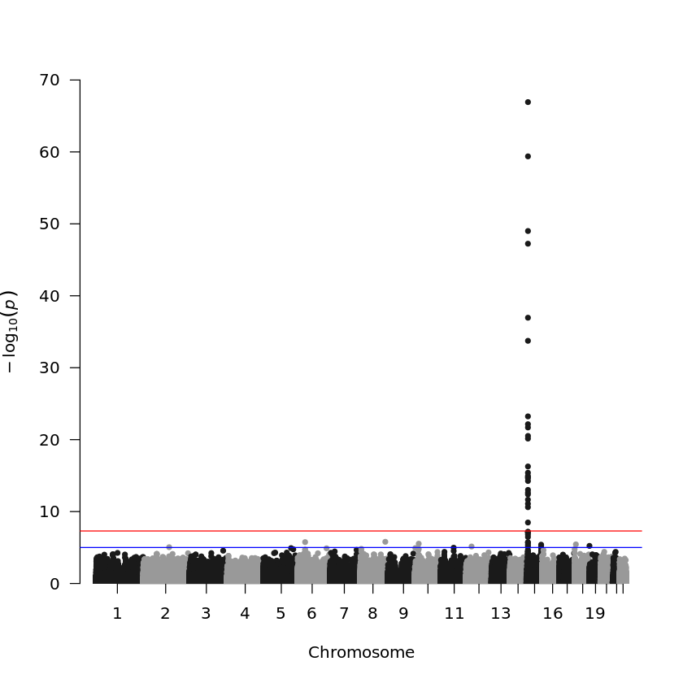
    


```R
qq(mlma_loco$p)
```


    
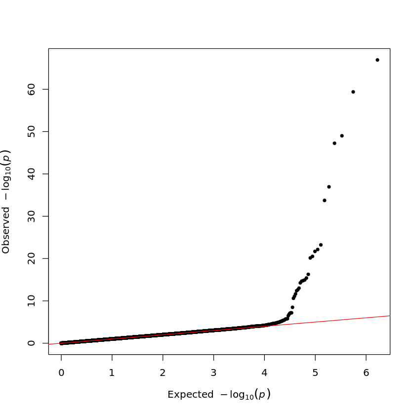
    


```R
qp = qchisq( mlma_loco  %>% select(p)  %>% na.omit()  %>% pull(), df=1, lower.tail=F) #chi^2 val for all p-values
median(qp)
qchisq(0.5, df=1, lower.tail=F) #expected median chi^2 value
print(paste("inflation factor:" ,median(qp)/qchisq(0.5, df=1, lower.tail=F)))
```


0.456734662608161


0.454936423119573


    [1] "inflation factor: 1.0039527270124"


The significant SNPs are the same for PC adjustment and Mixod models.  
There realy is no significant difference between the 2 approaches in this specific case.

# Estimating herritability

`
plink --make-grm-gz --bfile eye_color_QC --out eye_color_QC
`  
`
gcta64 --grm-gz eye_color_QC --pheno phenotypes_brown_vs_not.txt --reml --out test
`

Summary result of REML analysis:  
Source	Variance	SE  
V(G)	0.179705	0.044949  
V(e)	0.049255	0.043289  
Vp	    0.228960	0.009195  
V(G)/Vp	0.784875	0.189935   
   

V(g)/Vp is the REML estimate of the (narrow sense) heritability of the trait.  
The analysis estimates that ~80% of the phenotype can be explained by genotype  
Note this is an underestimate since we do not not have all genetic variation in this data set and since this method only models additive effect.
  
  
We can estimate the amount of heritability explained by the genetic variation on chr 15 by calculating a GRM matrix using only variants on chr 15


`
plink --make-grm-gz --bfile eye_color_QC --chr 15 --out eye_color_QC15
`  
`
gcta64 --grm-gz eye_color_QC15 --pheno phenotypes_brown_vs_not.txt --reml --out test15
`

Summary result of REML analysis:  
Source	Variance	SE  
V(G)	0.095756	0.014889  
V(e)	0.136165	0.012913  
Vp	0.231921	0.009623  
V(G)/Vp	0.412884	0.057292  
  
0.41/0.78 = 0.53  
  
It seems that 53% of the heritability is explained by chr 15  


```R
0.412884/0.784875
```


0.526050645007167


# Distribution of eye color for the most significant SNP

The most significant SNP is rs1667394, which is located on chr 15 downstream of OCA2 in an intron of HERC2.  


`
plink --recode A include-alt --bfile eye_color_QC --window 100 --snp rs1667394 --out genotypes
`


```R
genotypes <- read.table("genotypes.raw", header = T)  %>% select(-FID,-PAT,-MAT,-SEX,-PHENOTYPE)

pheno <- colors  %>% 
    mutate(color_binary = ifelse(eye_color %in% dark, 1, 2))


genotypes <- merge(genotypes, pheno , by = "IID")  %>% 
    select(IID, eye_color, color_binary, everything())  %>% 
    mutate(color_binary = as.factor(color_binary))
head(genotypes)

genotypes  %>% filter(!is.na(rs1667394_C..T.)) %>% 
    mutate(color_binary = factor(color_binary, levels = c(2,1))) %>% 
    ggplot(mapping=aes(x=rs1667394_C..T.))+
        geom_bar(mapping=aes(fill = color_binary) )+ #,position="dodge")
        scale_fill_manual(labels=c("Light","Brown"),values=c( "#085C98","#55230C" ))+
        labs(x = "rs1667394 genotype", fill = "Eye color")
```


<table class="dataframe">
<caption>A data.frame: 6 × 9</caption>
<thead>
	<tr><th></th><th scope=col>IID</th><th scope=col>eye_color</th><th scope=col>color_binary</th><th scope=col>rs8028689_C..T.</th><th scope=col>rs916977_T..C.</th><th scope=col>rs8039195_C..T.</th><th scope=col>rs16950987_A..G.</th><th scope=col>rs1667394_C..T.</th><th scope=col>rs1667400_A..C.</th></tr>
	<tr><th></th><th scope=col>&lt;int&gt;</th><th scope=col>&lt;chr&gt;</th><th scope=col>&lt;fct&gt;</th><th scope=col>&lt;int&gt;</th><th scope=col>&lt;int&gt;</th><th scope=col>&lt;int&gt;</th><th scope=col>&lt;int&gt;</th><th scope=col>&lt;int&gt;</th><th scope=col>&lt;int&gt;</th></tr>
</thead>
<tbody>
	<tr><th scope=row>1</th><td> 1</td><td>blue-green</td><td>2</td><td>0</td><td> 0</td><td>0</td><td>0</td><td>0</td><td>0</td></tr>
	<tr><th scope=row>2</th><td> 6</td><td>brown     </td><td>1</td><td>1</td><td>NA</td><td>1</td><td>1</td><td>1</td><td>0</td></tr>
	<tr><th scope=row>3</th><td> 8</td><td>brown     </td><td>1</td><td>0</td><td> 1</td><td>1</td><td>0</td><td>1</td><td>0</td></tr>
	<tr><th scope=row>4</th><td>10</td><td>brown     </td><td>1</td><td>2</td><td> 2</td><td>2</td><td>2</td><td>2</td><td>0</td></tr>
	<tr><th scope=row>5</th><td>11</td><td>brown     </td><td>1</td><td>0</td><td> 1</td><td>1</td><td>0</td><td>1</td><td>0</td></tr>
	<tr><th scope=row>6</th><td>13</td><td>brown     </td><td>1</td><td>0</td><td> 1</td><td>1</td><td>0</td><td>1</td><td>0</td></tr>
</tbody>
</table>


    
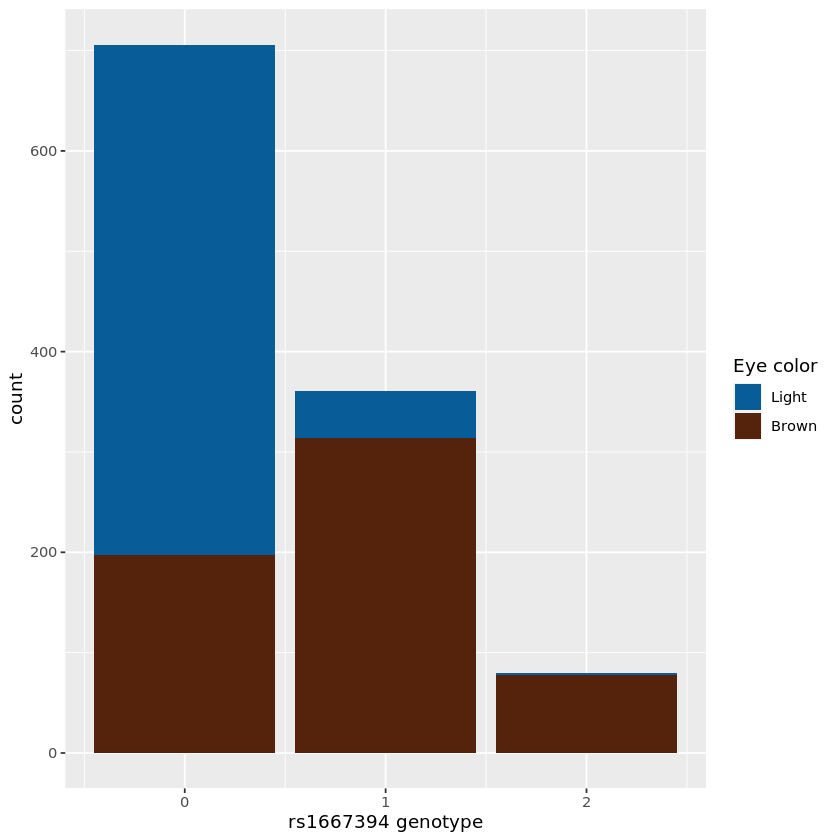
    


At first glance the light trait seems to be recesive. (nb when looking at this SNP for this limitied dataset)  
However, it is possible to have brown eyes even with the 0 genotype. Additionally you can have light eyes with the 1 and even the 2 genotype. The trait is therefore not as simple as a simple mendelrian reccsesive trait.   
However, it can probably easilly behave like that, if the sample size is small  
Lets look at the distribution of eye colors


```R
genotypes  %>% filter(!is.na(rs1667394_C..T.)) %>% 
    mutate(eye_color = factor(eye_color, levels = c(
        "dark_blue","blue", "blue-grey"
        ,'blue-green-grey','blue-green-gold','blue-green' #blue-green
        ,'green','green-gray' #green
        ,'hazel/brown-green', 'amber-brown'
        ,"brown"#brown
        ,'dark_brown' 
        ))) %>% 
    mutate(rs1667394_C..T. = factor(ifelse( rs1667394_C..T.==0 ,"A/A" ,ifelse( rs1667394_C..T.==1, "A/G", "G/G" ) )
                              ,levels = c("A/A", "A/G", "G/G"))) %>% 
    ggplot(mapping=aes(x=rs1667394_C..T.))+
        geom_bar(mapping=aes(fill = eye_color) )+ #,position="dodge")
        scale_fill_manual(values=c( "#1F1A6D","#085C98","#748EA6" ,"#008A88","#008A88" ,
                "#008A88","#6C9A4B","#88967D","#8F6E2D","#A26449","#55230C" ,"#280000"))+
        labs(x = "rs1667394 genotype", fill = "Eye color")
ggsave("eye_color_plot.pdf")
```

    Saving 6.67 x 6.67 in image
    


    
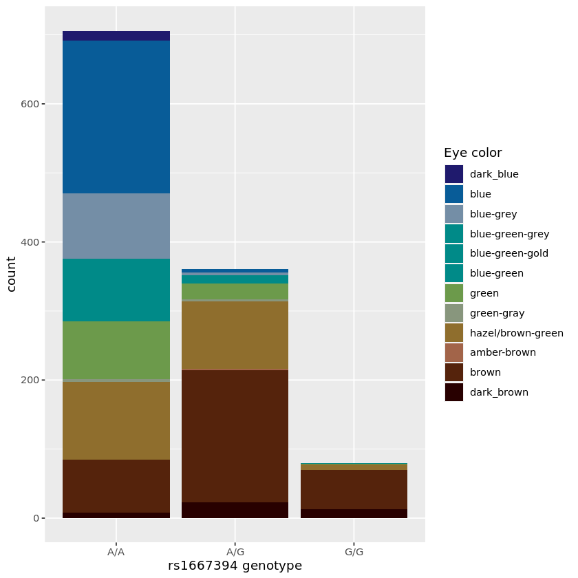
    


Interestingly the blue phenotype is almost exclusively associated with the 0 genoptype  
While the light colors in the 1 genotype is mostly green eyed individuals 

# Replicating test from papers
# 2021 paper - linear regression

The Simcoe et al. (2021) paper uses a linear model with eye colors represented as a linear scale
blue is at 1 end with dark brown in the other

They use the specific scale: (blue ,blue-green , green, light hazel, dark hazel, brown , dark brown)
our data has no light brown hazel, so we use categories: (blue ,blue-green , green, hazel, brown , dark brown)


```R
setwd("/faststorage/project/populationgenomics/students/askj/project/QC")
colors <- read.table("eye_color.txt")
setwd("/faststorage/project/populationgenomics/students/askj/project/linear")
colnames(colors) = c("IID", "eye_color")

c0 = c("blue", "blue-grey", "dark_blue") #pure blue
c1 = c('blue-green-grey','blue-green-gold','blue-green') #blue-green
c2 = c('green','green-gray' )#green
c3 = c('hazel/brown-green', 'amber-brown')
c4 = c("brown")#brown
c5 = c('dark_brown') #dark brown


pheno <- colors  %>% 
    mutate(color_scale = ifelse(eye_color %in% c0, 0, 
                          ifelse(eye_color %in% c1, 1,
                          ifelse(eye_color %in% c2, 2,  
                          ifelse(eye_color %in% c3, 3,
                          ifelse(eye_color %in% c4, 4, 5
                                 ))))))  %>% 
    mutate(FID = IID)

pheno  %>% 
    group_by(color_scale) %>% 
    summarize(n = n())
pheno <- pheno  %>% select(IID, FID, color_scale)


write.table(pheno, "phenotypes_scale.txt", col.names = FALSE, row.names = FALSE)
```


<table class="dataframe">
<caption>A tibble: 6 × 2</caption>
<thead>
	<tr><th></th><th scope=col>color_scale</th><th scope=col>n</th></tr>
	<tr><th></th><th scope=col>&lt;dbl&gt;</th><th scope=col>&lt;int&gt;</th></tr>
</thead>
<tbody>
	<tr><th scope=row>1</th><td>0</td><td>380</td></tr>
	<tr><th scope=row>2</th><td>1</td><td>113</td></tr>
	<tr><th scope=row>3</th><td>2</td><td>130</td></tr>
	<tr><th scope=row>4</th><td>3</td><td>244</td></tr>
	<tr><th scope=row>5</th><td>4</td><td>364</td></tr>
	<tr><th scope=row>6</th><td>5</td><td> 56</td></tr>
</tbody>
</table>


No groups are of alarmingly small size 

In the paper they use 5 first PCs, sex and age. Since we have no age and sex informarion we will use only PCs

`
plink --bfile eye_color_QC --linear --pheno phenotypes_scale.txt --allow-no-sex --covar pca.eigenvec --covar-number 1-5
`


```R
lin_model <- read.table('plink.assoc.linear', header = TRUE)

lin_model <- lin_model  %>% filter(TEST=="ADD")
lin_model  %>% arrange(BP)  %>% filter(P< 5e-8)

```


<table class="dataframe">
<caption>A data.frame: 24 × 9</caption>
<thead>
	<tr><th scope=col>CHR</th><th scope=col>SNP</th><th scope=col>BP</th><th scope=col>A1</th><th scope=col>TEST</th><th scope=col>NMISS</th><th scope=col>BETA</th><th scope=col>STAT</th><th scope=col>P</th></tr>
	<tr><th scope=col>&lt;int&gt;</th><th scope=col>&lt;chr&gt;</th><th scope=col>&lt;int&gt;</th><th scope=col>&lt;chr&gt;</th><th scope=col>&lt;chr&gt;</th><th scope=col>&lt;int&gt;</th><th scope=col>&lt;dbl&gt;</th><th scope=col>&lt;dbl&gt;</th><th scope=col>&lt;dbl&gt;</th></tr>
</thead>
<tbody>
	<tr><td>15</td><td>rs749846  </td><td>28268990</td><td>A</td><td>ADD</td><td> 998</td><td> 0.6241</td><td>  6.982</td><td>5.337e-12</td></tr>
	<tr><td>15</td><td>rs3794604 </td><td>28272065</td><td>T</td><td>ADD</td><td>1234</td><td> 0.7071</td><td>  7.880</td><td>7.188e-15</td></tr>
	<tr><td>15</td><td>rs4778232 </td><td>28281765</td><td>T</td><td>ADD</td><td>1259</td><td> 0.5748</td><td>  8.326</td><td>2.164e-16</td></tr>
	<tr><td>15</td><td>rs16950821</td><td>28283507</td><td>A</td><td>ADD</td><td>1260</td><td> 0.7625</td><td>  8.893</td><td>2.031e-18</td></tr>
	<tr><td>15</td><td>rs8024968 </td><td>28283689</td><td>T</td><td>ADD</td><td>1260</td><td> 0.7638</td><td>  8.952</td><td>1.231e-18</td></tr>
	<tr><td>15</td><td>rs7177686 </td><td>28287344</td><td>A</td><td>ADD</td><td> 661</td><td> 0.5872</td><td>  6.238</td><td>7.937e-10</td></tr>
	<tr><td>15</td><td>rs6497253 </td><td>28288549</td><td>A</td><td>ADD</td><td> 998</td><td> 0.5930</td><td>  7.585</td><td>7.647e-14</td></tr>
	<tr><td>15</td><td>rs1375164 </td><td>28291812</td><td>T</td><td>ADD</td><td> 962</td><td> 0.5771</td><td>  7.279</td><td>7.025e-13</td></tr>
	<tr><td>15</td><td>rs1597196 </td><td>28294922</td><td>T</td><td>ADD</td><td>1258</td><td> 0.6158</td><td>  8.416</td><td>1.048e-16</td></tr>
	<tr><td>15</td><td>rs7179994 </td><td>28323770</td><td>G</td><td>ADD</td><td>1259</td><td> 0.5115</td><td>  6.290</td><td>4.370e-10</td></tr>
	<tr><td>15</td><td>rs7174027 </td><td>28328765</td><td>A</td><td>ADD</td><td>1257</td><td> 0.8713</td><td>  9.578</td><td>5.088e-21</td></tr>
	<tr><td>15</td><td>rs4778138 </td><td>28335820</td><td>G</td><td>ADD</td><td>1033</td><td> 0.9567</td><td> 10.720</td><td>1.742e-25</td></tr>
	<tr><td>15</td><td>rs4778241 </td><td>28338713</td><td>A</td><td>ADD</td><td>1260</td><td> 1.1910</td><td> 16.670</td><td>1.727e-56</td></tr>
	<tr><td>15</td><td>rs7495174 </td><td>28344238</td><td>G</td><td>ADD</td><td>1260</td><td> 1.0640</td><td> 10.040</td><td>7.249e-23</td></tr>
	<tr><td>15</td><td>rs12593929</td><td>28359258</td><td>G</td><td>ADD</td><td> 701</td><td> 1.2170</td><td>  8.792</td><td>1.149e-17</td></tr>
	<tr><td>15</td><td>rs7183877 </td><td>28365733</td><td>A</td><td>ADD</td><td>1260</td><td> 1.1100</td><td> 11.120</td><td>1.758e-27</td></tr>
	<tr><td>15</td><td>rs3935591 </td><td>28374012</td><td>T</td><td>ADD</td><td> 636</td><td> 1.4490</td><td> 14.630</td><td>6.197e-42</td></tr>
	<tr><td>15</td><td>rs11636232</td><td>28386626</td><td>T</td><td>ADD</td><td>1235</td><td>-0.9032</td><td>-14.070</td><td>8.553e-42</td></tr>
	<tr><td>15</td><td>rs6497287 </td><td>28440287</td><td>C</td><td>ADD</td><td> 677</td><td> 1.1820</td><td>  8.704</td><td>2.471e-17</td></tr>
	<tr><td>15</td><td>rs8028689 </td><td>28488888</td><td>C</td><td>ADD</td><td> 736</td><td> 1.1200</td><td>  7.808</td><td>2.030e-14</td></tr>
	<tr><td>15</td><td>rs916977  </td><td>28513364</td><td>T</td><td>ADD</td><td>1111</td><td> 1.4650</td><td> 20.190</td><td>2.216e-77</td></tr>
	<tr><td>15</td><td>rs8039195 </td><td>28516084</td><td>C</td><td>ADD</td><td> 998</td><td> 1.4010</td><td> 17.850</td><td>5.301e-62</td></tr>
	<tr><td>15</td><td>rs16950987</td><td>28526228</td><td>A</td><td>ADD</td><td> 998</td><td> 1.2070</td><td> 10.130</td><td>5.048e-23</td></tr>
	<tr><td>15</td><td>rs1667394 </td><td>28530182</td><td>C</td><td>ADD</td><td>1147</td><td> 1.5050</td><td> 21.550</td><td>1.093e-86</td></tr>
</tbody>
</table>


```R
manhattan(lin_model,chr = "CHR",bp = "BP",p = "P",snp = "SNP" ,ylim = c(0, 90))
```


    
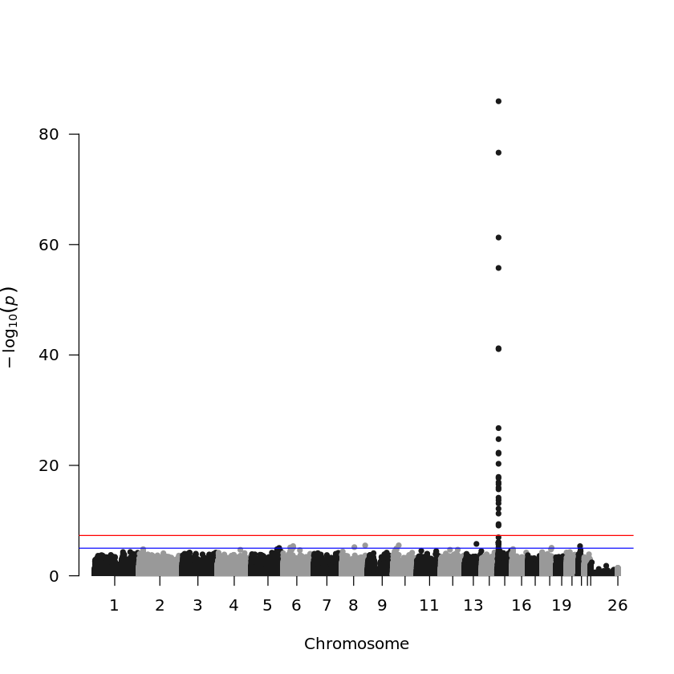
    


```R
manhattan(lin_model,chr = "CHR",bp = "BP",p = "P",snp = "SNP" ,ylim = c(0, 10))
```


    
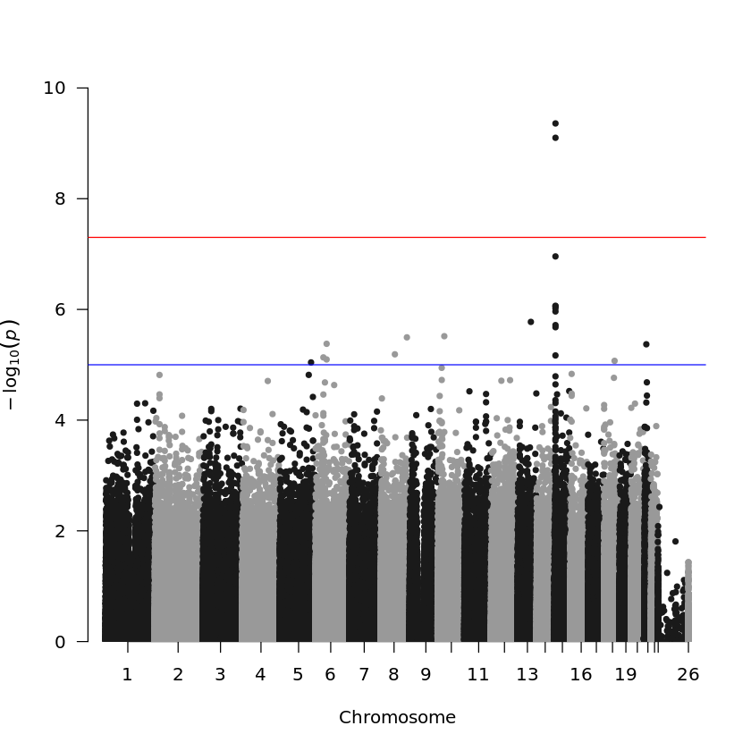
    


```R
qq(lin_model$P)

```


    
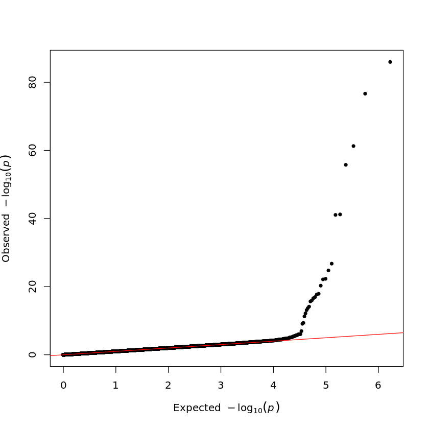
    


Same results as brown vs light analysis   
the rs1667394 SNP is still the most significant. This model produces an even lower p value than with light vs brown

### Same using Mixed models
`
gcta64 --mlma-loco --bfile eye_color_QC --pheno phenotypes_scale.txt --autosome --out eye_color_loco
`


```R
mlma_loco <- read.table('eye_color_loco.loco.mlma', header = TRUE)
```


```R
head(mlma_loco%>% arrange(p))
```


<table class="dataframe">
<caption>A data.frame: 6 × 9</caption>
<thead>
	<tr><th></th><th scope=col>Chr</th><th scope=col>SNP</th><th scope=col>bp</th><th scope=col>A1</th><th scope=col>A2</th><th scope=col>Freq</th><th scope=col>b</th><th scope=col>se</th><th scope=col>p</th></tr>
	<tr><th></th><th scope=col>&lt;int&gt;</th><th scope=col>&lt;chr&gt;</th><th scope=col>&lt;int&gt;</th><th scope=col>&lt;chr&gt;</th><th scope=col>&lt;chr&gt;</th><th scope=col>&lt;dbl&gt;</th><th scope=col>&lt;dbl&gt;</th><th scope=col>&lt;dbl&gt;</th><th scope=col>&lt;dbl&gt;</th></tr>
</thead>
<tbody>
	<tr><th scope=row>1</th><td>15</td><td>rs1667394 </td><td>28530182</td><td>C</td><td>T</td><td>0.227114</td><td> 1.52367</td><td>0.0825660</td><td>4.83975e-76</td></tr>
	<tr><th scope=row>2</th><td>15</td><td>rs916977  </td><td>28513364</td><td>T</td><td>C</td><td>0.220072</td><td> 1.47838</td><td>0.0845532</td><td>1.87847e-68</td></tr>
	<tr><th scope=row>3</th><td>15</td><td>rs8039195 </td><td>28516084</td><td>C</td><td>T</td><td>0.204409</td><td> 1.41648</td><td>0.0902219</td><td>1.51240e-55</td></tr>
	<tr><th scope=row>4</th><td>15</td><td>rs4778241 </td><td>28338713</td><td>A</td><td>C</td><td>0.223810</td><td> 1.23718</td><td>0.0793165</td><td>7.50650e-55</td></tr>
	<tr><th scope=row>5</th><td>15</td><td>rs11636232</td><td>28386626</td><td>T</td><td>C</td><td>0.334413</td><td>-0.93202</td><td>0.0689016</td><td>1.08610e-41</td></tr>
	<tr><th scope=row>6</th><td>15</td><td>rs3935591 </td><td>28374012</td><td>T</td><td>C</td><td>0.209906</td><td> 1.42407</td><td>0.1115230</td><td>2.43331e-37</td></tr>
</tbody>
</table>


```R
manhattan(mlma_loco,chr = "Chr",bp = "bp",p = "p",snp = "SNP" ,ylim = c(0, 70))
qq(mlma_loco$p)
```


    
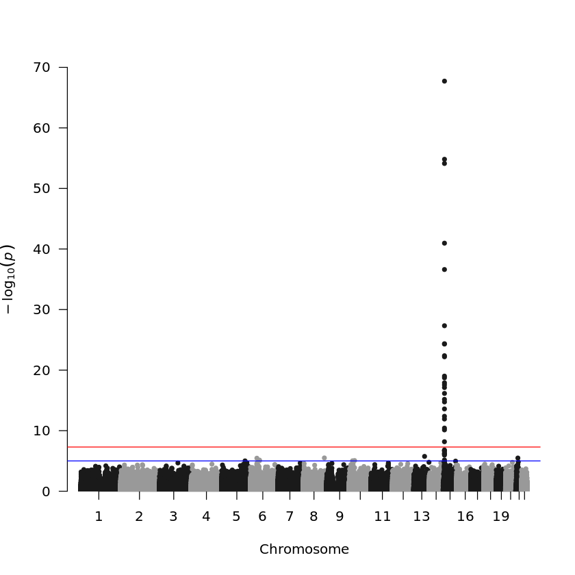
    


    
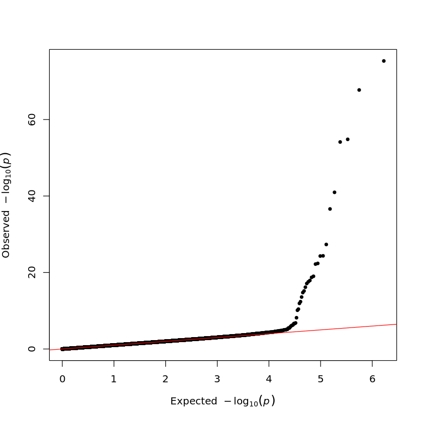
    


# Blue vs green vs brown

In the 2007 paper they test blue eye color vs brown and blue vs green


```R
setwd("/faststorage/project/populationgenomics/students/askj/project/QC")
colors <- read.table("eye_color.txt")
setwd("/faststorage/project/populationgenomics/students/askj/project/bluegreenbrown")
colnames(colors) = c("IID", "eye_color")

blue = c("blue", "blue-grey", "dark_blue") #pure blue
green = c('green','green-gray' )#green
brown = c("brown", "dark_brown", 'amber-brown')

blue_green <- colors  %>% 
    filter (eye_color %in% c(blue,green))  %>% 
    mutate(eye_color_bin = ifelse(eye_color %in% blue , 1, 2))  %>% 
    mutate(FID = IID)
head(blue_green)

blue_green  %>% 
    select(IID, FID, eye_color_bin) %>% 
    write.table( file = 'phenotypes_bluegreen.txt', col.names = F, row.names = F) 
blue_green  %>%  
    select(IID, FID)  %>% 
    write.table( file = 'filter_bluegreen.txt', col.names = F, row.names = F)


blue_brown <- colors  %>% 
    filter (eye_color %in% c(blue,brown))  %>% 
    mutate(eye_color_bin = ifelse(eye_color %in% blue , 1, 2))  %>% 
    mutate(FID = IID)
head(blue_brown)

blue_brown  %>% 
    select(IID, FID, eye_color_bin) %>% 
    write.table( file = 'phenotypes_bluebrown.txt', col.names = F, row.names = F) 
blue_brown  %>%  
    select(IID, FID)  %>% 
    write.table( file = 'filter_bluebrown.txt', col.names = F, row.names = F)


```


<table class="dataframe">
<caption>A data.frame: 6 × 4</caption>
<thead>
	<tr><th></th><th scope=col>IID</th><th scope=col>eye_color</th><th scope=col>eye_color_bin</th><th scope=col>FID</th></tr>
	<tr><th></th><th scope=col>&lt;int&gt;</th><th scope=col>&lt;chr&gt;</th><th scope=col>&lt;dbl&gt;</th><th scope=col>&lt;int&gt;</th></tr>
</thead>
<tbody>
	<tr><th scope=row>1</th><td>1020</td><td>blue </td><td>1</td><td>1020</td></tr>
	<tr><th scope=row>2</th><td>1024</td><td>blue </td><td>1</td><td>1024</td></tr>
	<tr><th scope=row>3</th><td>1028</td><td>blue </td><td>1</td><td>1028</td></tr>
	<tr><th scope=row>4</th><td>1039</td><td>blue </td><td>1</td><td>1039</td></tr>
	<tr><th scope=row>5</th><td>1041</td><td>blue </td><td>1</td><td>1041</td></tr>
	<tr><th scope=row>6</th><td>1042</td><td>green</td><td>2</td><td>1042</td></tr>
</tbody>
</table>


<table class="dataframe">
<caption>A data.frame: 6 × 4</caption>
<thead>
	<tr><th></th><th scope=col>IID</th><th scope=col>eye_color</th><th scope=col>eye_color_bin</th><th scope=col>FID</th></tr>
	<tr><th></th><th scope=col>&lt;int&gt;</th><th scope=col>&lt;chr&gt;</th><th scope=col>&lt;dbl&gt;</th><th scope=col>&lt;int&gt;</th></tr>
</thead>
<tbody>
	<tr><th scope=row>1</th><td>1010</td><td>brown</td><td>2</td><td>1010</td></tr>
	<tr><th scope=row>2</th><td>1020</td><td>blue </td><td>1</td><td>1020</td></tr>
	<tr><th scope=row>3</th><td>1024</td><td>blue </td><td>1</td><td>1024</td></tr>
	<tr><th scope=row>4</th><td>1028</td><td>blue </td><td>1</td><td>1028</td></tr>
	<tr><th scope=row>5</th><td>1033</td><td>brown</td><td>2</td><td>1033</td></tr>
	<tr><th scope=row>6</th><td>1034</td><td>brown</td><td>2</td><td>1034</td></tr>
</tbody>
</table>


Blue Green

`
plink --bfile eye_color_QC --keep filter_bluegreen.txt --make-bed --out eye_color_bluegreen
`

`
plink --bfile eye_color_bluegreen --indep-pairwise 500kb 5 0.2 --out pca_bg
`

`
plink --bfile eye_color_bluegreen --extract pca_bg.prune.in --pca 20 --out pca_bluegreen`  
  
`plink --bfile eye_color_bluegreen --logistic --pheno phenotypes_bluegreen.txt --allow-no-sex --covar pca_bluegreen.eigenvec --covar-number 1-2 --out bluegreen`
  
Blue Brown 
   
   
`plink --bfile eye_color_QC --keep filter_bluebrown.txt --make-bed --out eye_color_bluebrown`

`
plink --bfile eye_color_bluebrown --indep-pairwise 500kb 5 0.2 --out pca_bb
`

`
plink --bfile eye_color_bluebrown --extract pca_bb.prune.in --pca 20 --out pca_bluebrown
` 
  
`plink --bfile eye_color_bluebrown --logistic --pheno phenotypes_bluebrown.txt --allow-no-sex --covar pca_bluebrown.eigenvec --covar-number 1-2 --out bluebrown`


```R
test_bluegreen <- read.table('bluegreen.assoc.logistic', header = TRUE)
test_bluegreen <- test_bluegreen  %>% filter(TEST=="ADD")

dim(test_bluegreen)
head(test_bluegreen  %>% arrange(P))

manhattan(test_bluegreen,chr = "CHR",bp = "BP",p = "P",snp = "SNP",ylim=c(0,13) )
qq(test_bluegreen$P)
```


<style>
.list-inline {list-style: none; margin:0; padding: 0}
.list-inline>li {display: inline-block}
.list-inline>li:not(:last-child)::after {content: "\00b7"; padding: 0 .5ex}
</style>
<ol class=list-inline><li>837498</li><li>9</li></ol>


<table class="dataframe">
<caption>A data.frame: 6 × 9</caption>
<thead>
	<tr><th></th><th scope=col>CHR</th><th scope=col>SNP</th><th scope=col>BP</th><th scope=col>A1</th><th scope=col>TEST</th><th scope=col>NMISS</th><th scope=col>OR</th><th scope=col>STAT</th><th scope=col>P</th></tr>
	<tr><th></th><th scope=col>&lt;int&gt;</th><th scope=col>&lt;chr&gt;</th><th scope=col>&lt;int&gt;</th><th scope=col>&lt;chr&gt;</th><th scope=col>&lt;chr&gt;</th><th scope=col>&lt;int&gt;</th><th scope=col>&lt;dbl&gt;</th><th scope=col>&lt;dbl&gt;</th><th scope=col>&lt;dbl&gt;</th></tr>
</thead>
<tbody>
	<tr><th scope=row>1</th><td>15</td><td>rs1667394</td><td>28530182</td><td>C</td><td>ADD</td><td>454</td><td>10.860</td><td>5.851</td><td>4.891e-09</td></tr>
	<tr><th scope=row>2</th><td>15</td><td>rs916977 </td><td>28513364</td><td>T</td><td>ADD</td><td>439</td><td>11.320</td><td>5.692</td><td>1.256e-08</td></tr>
	<tr><th scope=row>3</th><td>15</td><td>rs8039195</td><td>28516084</td><td>C</td><td>ADD</td><td>387</td><td>10.180</td><td>5.334</td><td>9.598e-08</td></tr>
	<tr><th scope=row>4</th><td>15</td><td>rs7183877</td><td>28365733</td><td>A</td><td>ADD</td><td>501</td><td>11.110</td><td>4.949</td><td>7.478e-07</td></tr>
	<tr><th scope=row>5</th><td>17</td><td>rs7210122</td><td>72957715</td><td>C</td><td>ADD</td><td>401</td><td> 2.384</td><td>4.915</td><td>8.888e-07</td></tr>
	<tr><th scope=row>6</th><td>17</td><td>rs975627 </td><td>11222079</td><td>T</td><td>ADD</td><td>377</td><td> 2.424</td><td>4.773</td><td>1.815e-06</td></tr>
</tbody>
</table>


    
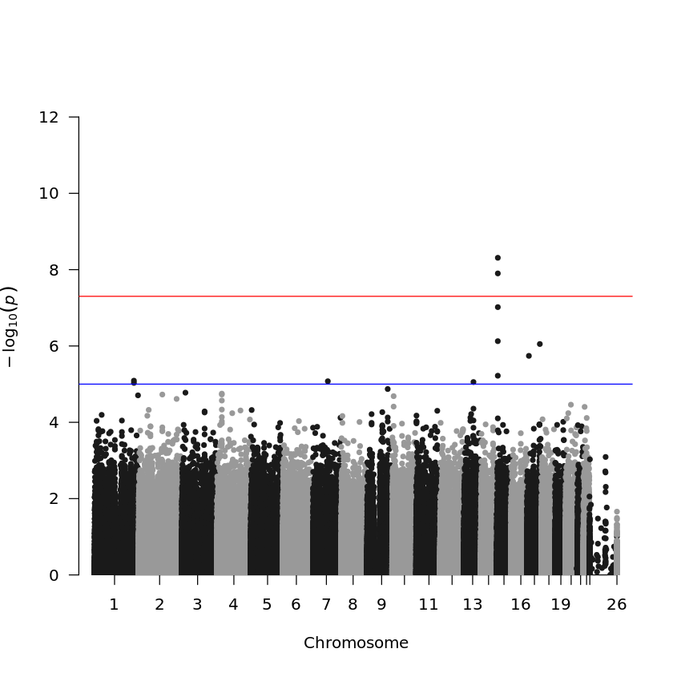
    


    
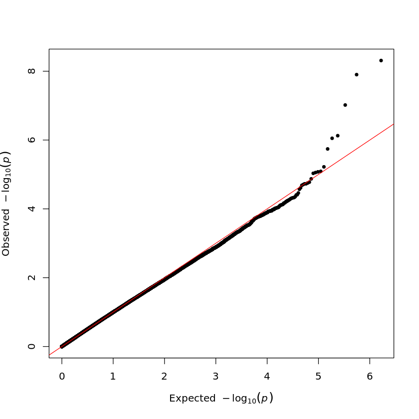
    


```R
test_bluebrown <- read.table('bluebrown.assoc.logistic', header = TRUE)
test_bluebrown <- test_bluebrown  %>% filter(TEST=="ADD")

dim(test_bluebrown)
head(test_bluebrown  %>% arrange(P))

manhattan(test_bluebrown,chr = "CHR",bp = "BP",p = "P",snp = "SNP",ylim=c(0,13))
qq(test_bluebrown$P)
```


<style>
.list-inline {list-style: none; margin:0; padding: 0}
.list-inline>li {display: inline-block}
.list-inline>li:not(:last-child)::after {content: "\00b7"; padding: 0 .5ex}
</style>
<ol class=list-inline><li>837498</li><li>9</li></ol>


<table class="dataframe">
<caption>A data.frame: 6 × 9</caption>
<thead>
	<tr><th></th><th scope=col>CHR</th><th scope=col>SNP</th><th scope=col>BP</th><th scope=col>A1</th><th scope=col>TEST</th><th scope=col>NMISS</th><th scope=col>OR</th><th scope=col>STAT</th><th scope=col>P</th></tr>
	<tr><th></th><th scope=col>&lt;int&gt;</th><th scope=col>&lt;chr&gt;</th><th scope=col>&lt;int&gt;</th><th scope=col>&lt;chr&gt;</th><th scope=col>&lt;chr&gt;</th><th scope=col>&lt;int&gt;</th><th scope=col>&lt;dbl&gt;</th><th scope=col>&lt;dbl&gt;</th><th scope=col>&lt;dbl&gt;</th></tr>
</thead>
<tbody>
	<tr><th scope=row>1</th><td>15</td><td>rs3794604 </td><td> 28272065</td><td>T</td><td>ADD</td><td>772</td><td>3.5350</td><td> 6.902</td><td>5.132e-12</td></tr>
	<tr><th scope=row>2</th><td>15</td><td>rs749846  </td><td> 28268990</td><td>A</td><td>ADD</td><td>613</td><td>3.2080</td><td> 6.431</td><td>1.270e-10</td></tr>
	<tr><th scope=row>3</th><td>11</td><td>rs1382242 </td><td>109813309</td><td>T</td><td>ADD</td><td>613</td><td>0.5165</td><td>-4.632</td><td>3.622e-06</td></tr>
	<tr><th scope=row>4</th><td>11</td><td>rs2217035 </td><td>109813406</td><td>A</td><td>ADD</td><td>612</td><td>0.5219</td><td>-4.591</td><td>4.405e-06</td></tr>
	<tr><th scope=row>5</th><td>10</td><td>rs3862575 </td><td> 33925036</td><td>T</td><td>ADD</td><td>759</td><td>0.2125</td><td>-4.529</td><td>5.917e-06</td></tr>
	<tr><th scope=row>6</th><td>11</td><td>rs11606636</td><td>109857236</td><td>C</td><td>ADD</td><td>613</td><td>0.5343</td><td>-4.498</td><td>6.853e-06</td></tr>
</tbody>
</table>


    
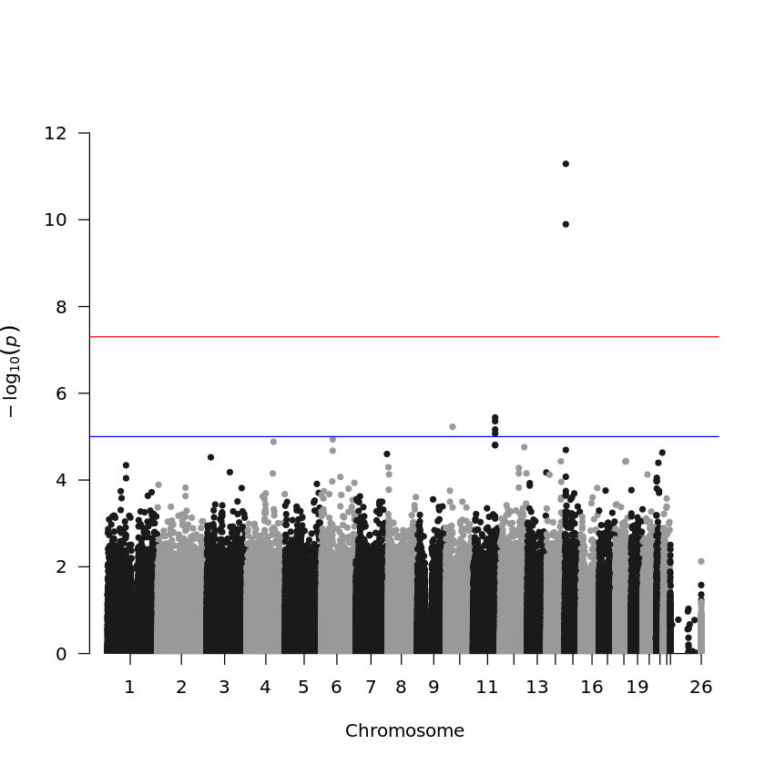
    


    
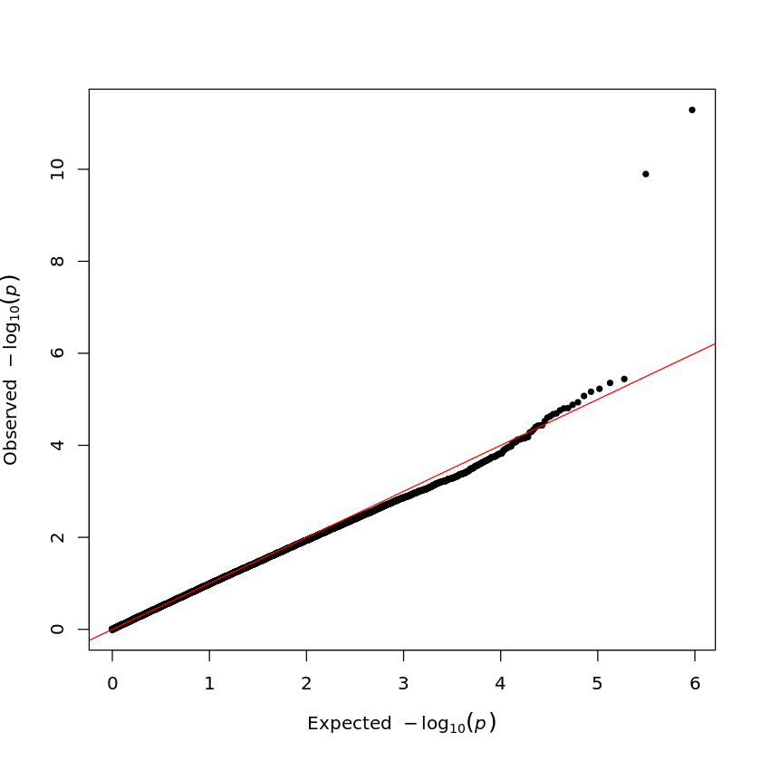
    


comparing blue eyes to only green or brown does not yield additional significant SNPs, but by considering only a subset of SNPs we limit the sample size even further, which reduces power significantly. The SNPs in the OCA2/HERC2 area has been reduced in significance from p value peaking at around 1e-50 down to around a p of 1e-10. 

  
The only new information is that blue and green eye color is significantly distinguished by the same SNP that distinguises light and brown eye color. Note this is also found in the 2007 paper 

`
plink --recode A include-alt --bfile eye_color_QC --window 100 --snp rs1667394 --out genotype_bg
`

`
plink --recode A include-alt --bfile eye_color_QC --window 100 --snp rs3794604 --out genotype_bb
`


```R
genotypes <- read.table("genotype_bg.raw", header = T)  %>% select(-FID,-PAT,-MAT,-SEX,-PHENOTYPE)


genotypes <- merge(genotypes, blue_green , by = "IID")  %>% 
    select(IID, eye_color, eye_color_bin, everything())  %>% 
    mutate(eye_color_bin = as.factor(eye_color_bin))
head(genotypes)

genotypes  %>% filter(!is.na(rs1667394_C..T.)) %>% 
    mutate(eye_color_bin = factor(eye_color_bin, levels = c(2,1))) %>% 
    ggplot(mapping=aes(x=rs1667394_C..T.))+
        geom_bar(mapping=aes(fill = eye_color_bin) )+ 
        scale_fill_manual(labels=c("Green","Blue"),values=c( "#6C9A4B" ,"#085C98"))+
        labs(x = "rs1667394 genotype", fill = "Eye color")
```


<table class="dataframe">
<caption>A data.frame: 6 × 10</caption>
<thead>
	<tr><th></th><th scope=col>IID</th><th scope=col>eye_color</th><th scope=col>eye_color_bin</th><th scope=col>rs8028689_C..T.</th><th scope=col>rs916977_T..C.</th><th scope=col>rs8039195_C..T.</th><th scope=col>rs16950987_A..G.</th><th scope=col>rs1667394_C..T.</th><th scope=col>rs1667400_A..C.</th><th scope=col>FID</th></tr>
	<tr><th></th><th scope=col>&lt;int&gt;</th><th scope=col>&lt;chr&gt;</th><th scope=col>&lt;fct&gt;</th><th scope=col>&lt;int&gt;</th><th scope=col>&lt;int&gt;</th><th scope=col>&lt;int&gt;</th><th scope=col>&lt;int&gt;</th><th scope=col>&lt;int&gt;</th><th scope=col>&lt;int&gt;</th><th scope=col>&lt;int&gt;</th></tr>
</thead>
<tbody>
	<tr><th scope=row>1</th><td>16</td><td>blue-grey</td><td>1</td><td>NA</td><td> 0</td><td>0</td><td>0</td><td>0</td><td>NA</td><td>16</td></tr>
	<tr><th scope=row>2</th><td>17</td><td>green    </td><td>2</td><td> 0</td><td>NA</td><td>0</td><td>0</td><td>0</td><td>NA</td><td>17</td></tr>
	<tr><th scope=row>3</th><td>22</td><td>green    </td><td>2</td><td> 0</td><td> 0</td><td>0</td><td>0</td><td>0</td><td> 0</td><td>22</td></tr>
	<tr><th scope=row>4</th><td>38</td><td>blue     </td><td>1</td><td> 0</td><td> 0</td><td>0</td><td>0</td><td>0</td><td> 0</td><td>38</td></tr>
	<tr><th scope=row>5</th><td>40</td><td>blue     </td><td>1</td><td> 0</td><td> 0</td><td>0</td><td>0</td><td>0</td><td> 0</td><td>40</td></tr>
	<tr><th scope=row>6</th><td>53</td><td>blue     </td><td>1</td><td> 0</td><td> 0</td><td>0</td><td>0</td><td>0</td><td> 0</td><td>53</td></tr>
</tbody>
</table>


    
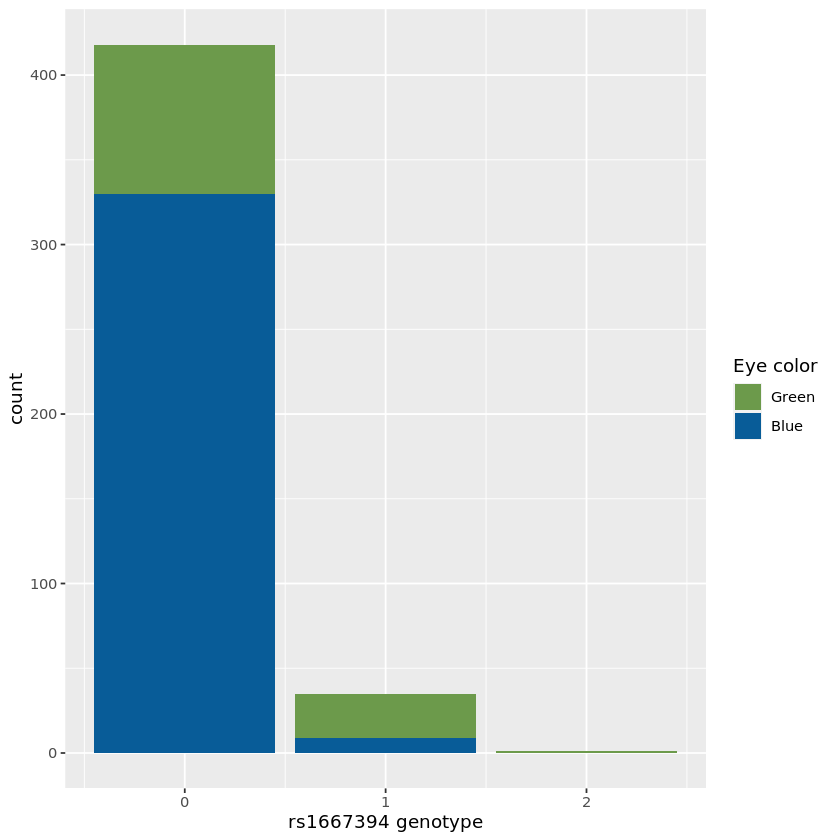
    


It is much more likely than you have green eyes compared to blue, if you are heterozygote at rs1667394  
Note this SNP is same as in the original analysis, so this plot can be infered from the plot of all the eye color phenotypes  


```R
genotypes <- read.table("genotype_bb.raw", header = T)  %>% select(-FID,-PAT,-MAT,-SEX,-PHENOTYPE)


genotypes <- merge(genotypes, blue_brown , by = "IID")  %>% 
    select(IID, eye_color, eye_color_bin, everything())  %>% 
    mutate(eye_color_bin = as.factor(eye_color_bin))
head(genotypes)

genotypes  %>% filter(!is.na(rs3794604_T..C.)) %>% 
    mutate(eye_color_bin = factor(eye_color_bin, levels = c(1,2))) %>% 
    ggplot(mapping=aes(x=rs3794604_T..C.))+
        geom_bar(mapping=aes(fill = eye_color_bin) )+
        scale_fill_manual( labels = c("Blue","Brown"),values=c( "#085C98","#55230C" ))+
        labs(x = "rs3794604 genotype", fill = "Eye color")
```


<table class="dataframe">
<caption>A data.frame: 6 × 40</caption>
<thead>
	<tr><th></th><th scope=col>IID</th><th scope=col>eye_color</th><th scope=col>eye_color_bin</th><th scope=col>rs12910433_G..A.</th><th scope=col>rs3794609_A..G.</th><th scope=col>rs1900758_C..T.</th><th scope=col>rs1800410_C..T.</th><th scope=col>rs1800407_T..C.</th><th scope=col>rs1037208_G..T.</th><th scope=col>rs12442916_A..G.</th><th scope=col>⋯</th><th scope=col>rs1375164_T..C.</th><th scope=col>rs1597196_T..G.</th><th scope=col>rs6497254_C..T.</th><th scope=col>rs7175552_A..G.</th><th scope=col>rs7162117_A..G.</th><th scope=col>rs1448481_C..T.</th><th scope=col>rs7179419_C..T.</th><th scope=col>rs7496968_G..A.</th><th scope=col>rs8032056_T..C.</th><th scope=col>FID</th></tr>
	<tr><th></th><th scope=col>&lt;int&gt;</th><th scope=col>&lt;chr&gt;</th><th scope=col>&lt;fct&gt;</th><th scope=col>&lt;int&gt;</th><th scope=col>&lt;int&gt;</th><th scope=col>&lt;int&gt;</th><th scope=col>&lt;int&gt;</th><th scope=col>&lt;int&gt;</th><th scope=col>&lt;int&gt;</th><th scope=col>&lt;int&gt;</th><th scope=col>⋯</th><th scope=col>&lt;int&gt;</th><th scope=col>&lt;int&gt;</th><th scope=col>&lt;int&gt;</th><th scope=col>&lt;int&gt;</th><th scope=col>&lt;int&gt;</th><th scope=col>&lt;int&gt;</th><th scope=col>&lt;int&gt;</th><th scope=col>&lt;int&gt;</th><th scope=col>&lt;int&gt;</th><th scope=col>&lt;int&gt;</th></tr>
</thead>
<tbody>
	<tr><th scope=row>1</th><td> 6</td><td>brown</td><td>2</td><td>1</td><td>1</td><td>1</td><td>1</td><td>0</td><td>0</td><td> 0</td><td>⋯</td><td>NA</td><td>2</td><td> 2</td><td>1</td><td> 1</td><td>1</td><td> 1</td><td>1</td><td>0</td><td> 6</td></tr>
	<tr><th scope=row>2</th><td> 8</td><td>brown</td><td>2</td><td>1</td><td>0</td><td>1</td><td>0</td><td>1</td><td>1</td><td> 0</td><td>⋯</td><td> 0</td><td>0</td><td> 0</td><td>0</td><td> 0</td><td>0</td><td> 0</td><td>0</td><td>0</td><td> 8</td></tr>
	<tr><th scope=row>3</th><td>10</td><td>brown</td><td>2</td><td>0</td><td>0</td><td>0</td><td>0</td><td>0</td><td>0</td><td> 0</td><td>⋯</td><td> 2</td><td>2</td><td> 2</td><td>0</td><td> 0</td><td>0</td><td> 0</td><td>0</td><td>0</td><td>10</td></tr>
	<tr><th scope=row>4</th><td>11</td><td>brown</td><td>2</td><td>0</td><td>0</td><td>0</td><td>0</td><td>0</td><td>0</td><td> 0</td><td>⋯</td><td> 0</td><td>0</td><td> 0</td><td>0</td><td> 0</td><td>0</td><td> 0</td><td>0</td><td>0</td><td>11</td></tr>
	<tr><th scope=row>5</th><td>13</td><td>brown</td><td>2</td><td>1</td><td>1</td><td>1</td><td>1</td><td>0</td><td>0</td><td> 0</td><td>⋯</td><td> 1</td><td>1</td><td>NA</td><td>0</td><td> 0</td><td>0</td><td> 0</td><td>0</td><td>0</td><td>13</td></tr>
	<tr><th scope=row>6</th><td>14</td><td>brown</td><td>2</td><td>0</td><td>0</td><td>0</td><td>0</td><td>0</td><td>0</td><td>NA</td><td>⋯</td><td>NA</td><td>1</td><td>NA</td><td>0</td><td>NA</td><td>0</td><td>NA</td><td>0</td><td>0</td><td>14</td></tr>
</tbody>
</table>


    
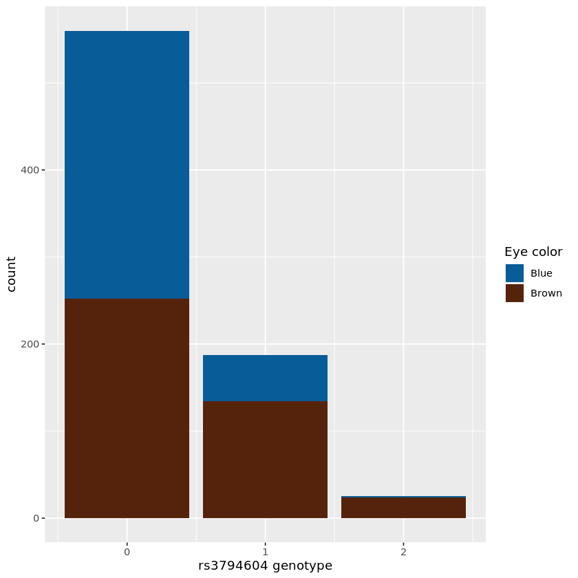
    


This looks very similar to the light vs brown plot of the rs1667394 snp
